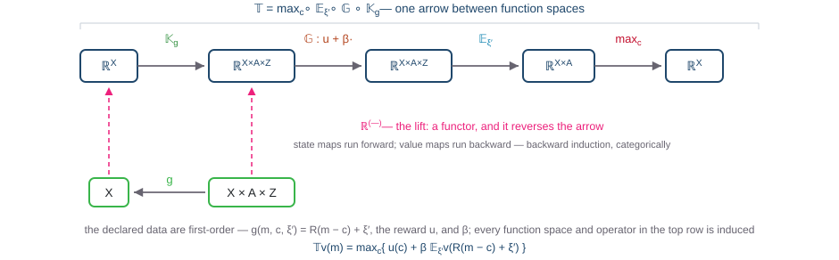
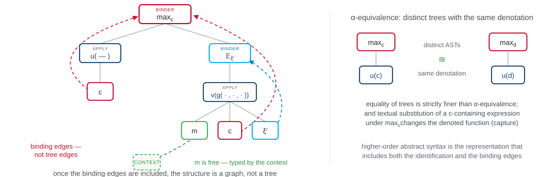

Introduction &middot; purpose and method

## Objective

Over 6-8 talks:

Develop enough working *basic* fluency in **category theory** and **type theory** arguments to  assess their usefulness for:

- applied high dimensional dynamic programming and reinforcement learning;
- formal representation of models on the computer; and
- AI systems that read, compare, transform, or *verify* those descriptions.

<strong>Overarching question.</strong> Does categorical type theory allow us to write structures that are too <strong>complicated</strong>, or that remain <strong>implicit</strong>, in the notation of fields like analysis, calculus, and optimisation?

---

Introduction &middot; Category theory

## Category theory

- Organizes objects and morphisms with specified domains and codomains.
- The focus shifts from properties of objects to relations between objects and the transformations of those relations.
- Standard results can be proved with "less complex" arguments:
  - results general enough to be used across fields.

---

Introduction &middot; Type theory

## Type theory: well-formed syntax

- A **term** is a syntactic expression built from typed variables, constants, and operation symbols by finitely many applications of the formation rules — for example $u(c)$ or $R(m-c)+\xi'$.
- Types classify terms and rule out invalid combinations among them.
- A judgment $\Gamma \vdash t : A$ says that the term $t$ has type $A$ in context $\Gamma$.
- Contexts record the typed inputs available; substitution describes how one well-typed expression is inserted into another.

<strong>Categorical type theory.</strong> A type theory generates a syntactic or classifying category. 
A model is a structure-preserving functor from that category into a semantic category.
 Type theory specifies what may be composed; category theory records how it composes and how it is interpreted.

Jacobs (1999), pp. 5–7 and Chapter 2: typed contexts and terms generate a category; models are structure-preserving functors from its classifying category.

---

Introduction &middot; Motivation 

## Motivating application: symbolic DP

Formal symbolic system to capture ADPs and RDPs
- programmable 'syntax'
- we want to represent the abstract model and map it to computational implementations
- we *do not* want to represent computational procedures
- denotational vs. operational semantics. 

Closely related: functional programming (Backus, 1978) system for DP 

  
declaretyped syntax signature + grammar

  
→

  
organiseclassifying category CΣ

  
→

  
interpretsemantics: mathematics or code

---

Category theory &middot; Riehl §1.1

## A category

**Definition 1.1.1.** A category consists of a collection of **objects** $X, Y, Z, \ldots$ and a collection of **morphisms** $f, g, h, \ldots$ such that each morphism has a specified domain and codomain ($f : X \to Y$), each object has an identity $\mathrm{id}_X : X \to X$, and each composable pair has a specified composite — $f : X \to Y$ and $g : Y \to Z$ yield $gf : X \to Z$ — subject to two axioms:

- **unitality**: $\mathrm{id}_Y f = f = f\, \mathrm{id}_X$ for every $f : X \to Y$;
- **associativity**: $h(gf) = (hg)f$ for every composable triple.

Nothing else is given: no elements, no membership, no underlying sets. The objects are recoverable from the identity morphisms (Remark 1.1.2), so of the two collections it is the **morphisms** that take primacy — a category is an algebra of composition.

Riehl (2016), Definition 1.1.1 and Remark 1.1.2, §1.1, pp. 3–4. Numbering verified against the chapter text held beside lit-kb.

---

Category theory &middot; Riehl §1.1

## Examples: morphisms need not be functions

### Concrete — objects carry sets

- $\mathsf{Set}$: sets and functions.
- $\mathsf{Vect}_k$: vector spaces and linear maps.
- $\mathsf{Meas}$: measurable spaces and measurable functions.
- $\mathsf{Poset}$: partially ordered sets and order-preserving maps.

### Abstract — they need not

- $\mathsf{Mat}_{\mathbb{R}}$: objects are positive integers; a morphism $n \to m$ is an $m \times n$ matrix; composition **is** matrix multiplication.
- $\mathsf{B}M$: one object; morphisms are the elements of a monoid $M$; composition is multiplication.
- A preorder $(P, \leq)$: one morphism $x \to y$ exactly when $x \leq y$; transitivity is composition, reflexivity the identities.

<strong>Reading.</strong> Definition 1.1.1 is the algebra shared by linear maps written without vectors, monoids written without elements, and order relations written as arrows.

Riehl (2016), Example 1.1.3 (i), (v), (ix), (x) and Example 1.1.4 (i)–(iii), §1.1, pp. 4–5.

---

Category theory &middot; Riehl §1.1

## Isomorphism: sameness without elements

**Definition 1.1.10.** A morphism $f : X \to Y$ is an **isomorphism** when there exists $g : Y \to X$ with $gf = \mathrm{id}_X$ and $fg = \mathrm{id}_Y$; the objects are then isomorphic, $X \cong Y$.

- In $\mathsf{Set}$, the isomorphisms are the bijections.
- In $\mathsf{Top}$, they are the homeomorphisms — strictly stronger than bijective-and-continuous. The ambient category, not the underlying sets, decides what counts as the same.
- In a poset, the only isomorphisms are the identities — the categorical statement of antisymmetry.

> "A category provides a context in which to answer the question 'When is one thing the same as another thing?'" — Riehl, §1.1

Riehl (2016), Definition 1.1.10 and Example 1.1.11 (i), (iii), (v), §1.1, pp. 7–8.

---

Category theory &middot; Riehl §1.2

## The opposite category and duality

**Definition 1.2.1.** The opposite category $\mathsf{C}^{\mathrm{op}}$ has the same objects as $\mathsf{C}$ and a morphism $f^{\mathrm{op}} : y \to x$ for each $f : x \to y$ of $\mathsf{C}$, with composites $f^{\mathrm{op}} g^{\mathrm{op}} = (gf)^{\mathrm{op}}$.

A theorem proved for all categories holds in particular for every $\mathsf{C}^{\mathrm{op}}$, and re-reading it there yields a second theorem about $\mathsf{C}$ with all arrows reversed — "a two-for-one deal: any proof in category theory simultaneously proves two theorems" (p. 10).

**Lemma 1.2.3.** For $f : x \to y$ the following are equivalent: (i) $f$ is an isomorphism; (ii) postcomposition $f_{*} : \mathsf{C}(c, x) \to \mathsf{C}(c, y)$ is a bijection for every $c$; (iii) precomposition $f^{*} : \mathsf{C}(y, c) \to \mathsf{C}(x, c)$ is a bijection for every $c$. Riehl proves (i) ⇔ (ii) directly and obtains (i) ⇔ (iii) by running that argument in $\mathsf{C}^{\mathrm{op}}$ — an application of the duality principle.

<strong>Exercise 1.2.vii.</strong> Regard a poset (P, ≤) as a category. Define the supremum of a collection of objects so that the dual statement defines the infimum, and prove that the supremum is unique whenever it exists, so that the dual proof gives uniqueness of the infimum. The duality between supremum and infimum, familiar from analysis, is categorical duality exactly.

Riehl (2016), Definition 1.2.1 (p. 9); the two-for-one description of duality (p. 10); Lemma 1.2.3 and Remark 1.2.4 (p. 11) — isomorphisms are characterized representably; Exercise 1.2.vii (pp. 13–14).

---

Category theory &middot; Riehl §1.2

## Monomorphisms and epimorphisms

Definitions dualize as theorems do; the two notions below are each other's duals, and one proof serves both.

**Definition 1.2.7.** A morphism $f$ is a **monomorphism** if $fh = fk$ implies $h = k$, and an **epimorphism** if $hf = kf$ implies $h = k$; the two notions are dual.

- In $\mathsf{Set}$: monomorphisms are the injections and epimorphisms the surjections (Example 1.2.8); "every epimorphism in $\mathsf{Set}$ splits" is precisely the axiom of choice (Remark 1.2.10).
- In $\mathsf{Ring}$: the inclusion $\mathbb{Z} \hookrightarrow \mathbb{Q}$ is monic **and** epic yet not an isomorphism — a ring homomorphism out of $\mathbb{Q}$ is already determined on $\mathbb{Z}$ (Example 1.2.11).

<strong>Moral.</strong> Categorical surjectivity is right-cancellability, and it can hold without surjectivity; the ambient category fixes the meaning of the concept.

Riehl (2016), Definitions 1.2.1 and 1.2.7, Examples 1.2.8 and 1.2.11, Remark 1.2.10, §1.2, pp. 9–13.

---

Category theory &middot; Riehl §1.3

## Functors

**Definition 1.3.1.** A functor $F : \mathsf{C} \to \mathsf{D}$ assigns an object $Fc$ to each object $c$ and a morphism $Ff : Fc \to Fc'$ to each $f : c \to c'$, preserving the structure: $Fg \cdot Ff = F(gf)$ and $F(\mathrm{id}_c) = \mathrm{id}_{Fc}$.

- Forgetful, $U : \mathsf{Vect}_k \to \mathsf{Set}$; free, $F : \mathsf{Set} \to \mathsf{Group}$.
- The fundamental group $\pi_1 : \mathsf{Top}_* \to \mathsf{Group}$ — the archetype of an invariant.
- The derivative: the chain rule $D(g \circ f)_a = Dg_{f(a)} \cdot Df_a$ states exactly that $f \mapsto Df$ is functorial on pointed Euclidean spaces (Example 1.3.2(x)).
- A **contravariant** functor is a functor $\mathsf{C}^{\mathrm{op}} \to \mathsf{D}$ (Definition 1.3.5) — the shape of $\mathbb{R}^{(-)}$ in the motivation, which reversed the transition's direction.

Riehl (2016), Definitions 1.3.1 and 1.3.5, Example 1.3.2 (ii), (vi), (ix), (x), §1.3, pp. 14–18.

---

Category theory &middot; Riehl §1.3

## Functoriality, in more detail

> "…every sufficiently good analogy is yearning to become a functor." — John Baez, epigraph to §1.3

- **Represented functors** (Definition 1.3.11). For locally small $\mathsf{C}$ and $c \in \mathsf{C}$: the covariant $\mathsf{C}(c, -) : \mathsf{C} \to \mathsf{Set}$ sends $x \mapsto \mathsf{C}(c, x)$ and $f \mapsto f_{*}$; the contravariant $\mathsf{C}(-, c) : \mathsf{C}^{\mathrm{op}} \to \mathsf{Set}$ sends $f \mapsto f^{*}$. Postcomposition is always covariant, precomposition always contravariant. The motivation's $\mathbb{R}^{(-)} = \mathsf{Set}(-, \mathbb{R})$ is the functor represented by $\mathbb{R}$.
- **Connection to Lemma 1.2.3.** Applying "functors preserve isomorphisms" to the represented functors re-proves (i) ⇒ (ii) and (i) ⇒ (iii) of Lemma 1.2.3.
- **Bifunctoriality** (Definitions 1.3.12–1.3.13). The product $\mathsf{C} \times \mathsf{D}$ is formed componentwise, and the two represented functors combine into one bifunctor $\mathsf{C}(-, -) : \mathsf{C}^{\mathrm{op}} \times \mathsf{C} \to \mathsf{Set}$, acting on morphisms by $g \mapsto h g f$.
- **What functors preserve.** Split monomorphisms and split epimorphisms are preserved, because their one-sided inverses are equations; general monomorphisms and epimorphisms need not be.
- **$\mathsf{Cat}$.** Small categories and functors form a category $\mathsf{Cat}$, which is locally small but not small — the size distinctions of §1.1 return.

Riehl (2016), §1.3: Definition 1.3.11 and the covariance remark (pp. 20–21); Definitions 1.3.12–1.3.13 (p. 21); preservation of split monomorphisms and epimorphisms (p. 20); Cat (p. 21); Baez epigraph (p. 14).

---

Category theory &middot; Riehl §1.3

## The first lemma of category theory

**Lemma 1.3.8.** *Functors preserve isomorphisms.*

**Proof.** Let $F : \mathsf{C} \to \mathsf{D}$ be a functor and $f : x \to y$ an isomorphism with inverse $g : y \to x$. By the two functoriality axioms,

$$Fg \cdot Ff \;=\; F(gf) \;=\; F(\mathrm{id}_x) \;=\; \mathrm{id}_{Fx},$$

so $Fg$ is a left inverse of $Ff$; exchanging the roles of $f$ and $g$ — or arguing by duality — makes it a right inverse as well. $\blacksquare$

- **Invariants.** If $\pi_1(X) \not\cong \pi_1(Y)$, then $X \not\cong Y$: any functorial assignment separates objects it sends to non-isomorphic values.
- **Group actions.** A functor $\mathsf{B}G \to \mathsf{C}$ is exactly an action of $G$; each $g \in G$ is an isomorphism in $\mathsf{B}G$, so it must act by automorphisms, with $(g^{-1})_* = (g_*)^{-1}$, no separate proof required (Corollary 1.3.10).
- **Outlook.** In the motivation, elaboration was a functor; the lemma is the first instance of the pattern these sessions develop — properties established for the syntax transfer to every interpretation.

Riehl (2016), Lemma 1.3.8 with proof, and Corollary 1.3.10, §1.3, pp. 19–20. The lemma appears immediately after functors are first defined in Eilenberg–Mac Lane (1942) — "arguably the first lemma in category theory" (Riehl).

---

Application &middot; standard of evaluation

## How we will proceed

Approximately three quarters of the time will be devoted to definitions, examples, and short arguments. The aim is to become fluent in the mathematical language, rather than to survey ambitious applications.

The applications to dynamic programming and AI provide the test. Each example should identify exactly what the categorical or typed formulation makes easier to state, compare, transform, or verify.

### Potential return

Greater precision, compositionality, and transfer across models.

### Principal risk

Additional abstraction that redescribes familiar mathematics without producing a practical gain.

<!-- Optional epigraph:
"Applied category theory is information plumbing. It is boring … but plumbers save more lives than doctors."
— DisCoPy documentation
-->

---

Motivation &middot; example: the Bellman operator, drawn in the category

## First-order in, higher-order out

<strong>The same 𝕋, in the categorical convention.</strong> The previous slide drew operators as boxes with the value function on the wires, the convention of functional programming. Here the objects are the function spaces and the operators are the arrows. The bottom row contains the only declared map, the first-order transition g, which runs forward in time. The functor ℝ^(−) sends g to 𝕂_g, reversing its direction, and composition with 𝔾, 𝔼_ξ′, and max_c yields 𝕋 : ℝ^X → ℝ^X; every higher-order object on the slide is induced from the declared data.

Buffer stock as before; stationary case, so next-period and current value functions share ℝ^X. Two drawings, one composite: spaces-as-objects (this slide) and operators-as-boxes (previous slide) present the same arrow 𝕋 = max_c ∘ 𝔼_ξ′ ∘ 𝔾 ∘ 𝕂_g.

## The same bridge in dynamic programming

**Deterministic dynamic programming.** Typing separates the declared data $g : X \times A \to X$ and $r : X \times A \to \mathbb{R}$ from what they induce: precomposition lifts the transition to $g^{*} : \mathbb{R}^{X} \to \mathbb{R}^{X \times A}$, and reward, discounting, and optimisation compose into the Bellman operator $\mathbb{T} = \max_a \circ\, (r + \beta\,\cdot) \circ g^{*}$.

**Markov decision processes and reinforcement learning.** Replace $g$ by a stochastic kernel $P : X \times A \rightsquigarrow X$. Kernels compose by Chapman–Kolmogorov, the Dirac kernels are the identities, and expectation lifts $P$ to $\mathbb{E}_{P} : \mathbb{R}^{X} \to \mathbb{R}^{X \times A}$. Reinforcement learning adds typed objects for observations, samples, parameters, policies, and update maps.

**Abstract dynamic programming.** Retain an abstract value object $V$ with admissible transition, aggregation, and optimisation morphisms, and ask which composition pattern is preserved across deterministic, stochastic, approximate, and executable interpretations.

<strong>The proposed gain.</strong> Types prevent domain–codomain errors; categories expose the common composition; functors relate one typed specification to its mathematical, numerical, and executable models.

Measurable spaces and stochastic kernels form a category with Chapman–Kolmogorov composition and Dirac identities. The abstract-DP reading is a proposed application to be evaluated, not a claim that one categorical formalism already covers every case.

---

Application &middot; example: start from the model

## The model is higher-order; a parse tree is first-order

$$v(m) \;=\; \max_{c \,\in\, \Gamma(m)} \Big\{\, u(c) \;+\; \beta\, \mathbb{E}_{\xi'}\, v\big(R(m-c)+\xi'\big) \Big\} \qquad\text{i.e.}\qquad v = \mathbb{T}\,v$$

The equation quantifies over a **function**: $v$ ranges over $\mathbb{R}^X$, and $\mathbb{T}$ maps functions to functions. A parser produces only first-order expressions between variables. There are three reasons why no node of the tree can be $\mathbb{T}$, and one repair:

1

No sort for function spaces

An AST is the term algebra of a <strong>first-order</strong> signature (ADJ 1977); its sorts are the grammar's expression categories — scalars here. 𝕋 : ℝ^X → ℝ^X is a map between function spaces, for which the grammar has no sort.

2

Typing and binding are not part of the tree

Well-typedness is a judgment made relative to a list of typed variables that the tree does not include, and no context-free rule expresses it; max_c and 𝔼_ξ′ bind variables whose scope the tree structure does not determine.

3

𝕋 is named, never parsed

A declaration node — op bellman — can list the equations, but that node is first-order syntax. The map between function spaces is the block's <strong>denotation</strong>, produced by elaboration under a typed semantic context rather than by parsing.

4

The repair

Parse only the <strong>first-order data</strong> (g, u, β) with their types; <strong>elaboration</strong> by Υ then produces the higher-order operator graph, as the next slides show.

The CEF interoperability talk v2.4 states the point: a PBF/BNF tree has nodes for "expressions between variables" but "no node for an operator like 𝕋" — it must be "elaborated under a typed semantic context, not parsed"; the economist writes only first-order equations, and the lift induces the function-analytic objects. AST = initial algebra of a first-order signature: Goguen–Thatcher–Wagner–Wright (1977). In practice as well, well-formedness is stated outside the grammar: Stan's manual gives BNF "plus extra-grammatical constraints on function typing" (lit-kb chunk). Binding beyond first-order trees: higher-order abstract syntax (Pfenning–Elliott 1988; Oliveira–Löh 2012 for DSLs); initial semantics with binding: Fiore–Plotkin–Turi (1999), Lamiaux–Ahrens (2024).

---

Application &middot; example: what the tree cannot carry

## An AST cannot represent bound variables

<strong>Two failures.</strong> The relation between a binder and its occurrences is not an edge of the tree: the association runs only through the repeated letter c, and once it is drawn as edges the structure is a graph. Distinct trees, max_c u(c) and max_d u(d), denote the same function, so equality of trees is strictly finer than equality of meaning. A first-order tree therefore neither records binding nor respects α-equivalence; higher-order abstract syntax is the representation that does both.

Bound occurrences are coloured with their binders (c with max_c, ξ′ with 𝔼_ξ′); m is free and is typed by the context, which the next slide draws in full. Higher-order abstract syntax: Pfenning–Elliott (1988); abstract syntax graphs for DSLs: Oliveira–Löh (2012); initial semantics with binding: Fiore–Plotkin–Turi (1999), Lamiaux–Ahrens (2024) — the last three indexed in lit-kb.

---

Application &middot; example: elaboration, step by step

## From the typed AST to the operator graph

<strong>Step by step.</strong> ① Parse the declaration: an op bellman node lists first-order equations, and the context — drawn beside the tree — assigns types to its leaves. ② ⟦·⟧ sends each equation to its first-order denotation, the arrow g, the reward u, and the feasibility correspondence m ↦ Γ(m); this map is the unique homomorphism out of the term algebra (ADJ 1977). ③ The functor ℝ^(−) sends each denotation to its operator box, reversing the direction of g — the categorical form of backward induction. ④ Composition yields ⟦op bellman⟧ = 𝕋: the denotation of the declaration is the higher-order object that was never parsed.

Buffer stock (CEF interoperability talk v2.4): 𝕋v(m) = max_c { u(c) + β 𝔼_ξ′ v(R(m−c) + ξ′) }, g(m, c, ξ′) = R(m−c) + ξ′; R enters by calibration, not through the context. Operator names follow the Bellman-calculus decomposition B_≻ = 𝔼_η ∘ 𝔾_≻ ∘ 𝕂_g≻; max = evaluate ∘ ⟨id, argmax⟩ is derived, and the 𝔼 ∘ 𝔾 ∘ 𝕂 split assumes an expected-utility kernel. Υ is the unique homomorphism out of the term algebra — initial-algebra semantics (ADJ 1977).

---

Application &middot; example: the Bellman operator, drawn in the category

## First-order in, higher-order out

<strong>The same 𝕋, in the categorical convention.</strong> The previous slide drew operators as boxes with the value function on the wires, the convention of functional programming. Here the objects are the function spaces and the operators are the arrows. The bottom row contains the only declared map, the first-order transition g, which runs forward in time. The functor ℝ^(−) sends g to 𝕂_g, reversing its direction, and composition with 𝔾, 𝔼_ξ′, and max_c yields 𝕋 : ℝ^X → ℝ^X; every higher-order object on the slide is induced from the declared data.

Buffer stock as before; stationary case, so next-period and current value functions share ℝ^X. Two drawings, one composite: spaces-as-objects (this slide) and operators-as-boxes (previous slide) present the same arrow 𝕋 = max_c ∘ 𝔼_ξ′ ∘ 𝔾 ∘ 𝕂_g.

## The same bridge in dynamic programming

**Deterministic dynamic programming.** Typing separates the declared data $g : X \times A \to X$ and $r : X \times A \to \mathbb{R}$ from what they induce: precomposition lifts the transition to $g^{*} : \mathbb{R}^{X} \to \mathbb{R}^{X \times A}$, and reward, discounting, and optimisation compose into the Bellman operator $\mathbb{T} = \max_a \circ\, (r + \beta\,\cdot) \circ g^{*}$.

**Markov decision processes and reinforcement learning.** Replace $g$ by a stochastic kernel $P : X \times A \rightsquigarrow X$. Kernels compose by Chapman–Kolmogorov, the Dirac kernels are the identities, and expectation lifts $P$ to $\mathbb{E}_{P} : \mathbb{R}^{X} \to \mathbb{R}^{X \times A}$. Reinforcement learning adds typed objects for observations, samples, parameters, policies, and update maps.

**Abstract dynamic programming.** Retain an abstract value object $V$ with admissible transition, aggregation, and optimisation morphisms, and ask which composition pattern is preserved across deterministic, stochastic, approximate, and executable interpretations.

<strong>The proposed gain.</strong> Types prevent domain–codomain errors; categories expose the common composition; functors relate one typed specification to its mathematical, numerical, and executable models.

Measurable spaces and stochastic kernels form a category with Chapman–Kolmogorov composition and Dirac identities. The abstract-DP reading is a proposed application to be evaluated, not a claim that one categorical formalism already covers every case.

---

Introduction &middot; sequence

## Topics

1. Categories and functors
2. Natural transformations
3. Universal properties and representable functors
4. The Yoneda lemma
5. Limits and colimits
6. Type theory: terms, types, judgments, and contexts
7. Categorical semantics: from typed syntax to models
8. Applications
   - dynamic programming, MDPs, and reinforcement learning
   - precise model descriptions for AI
