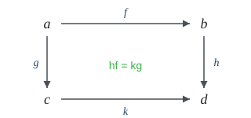
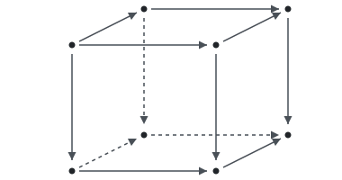
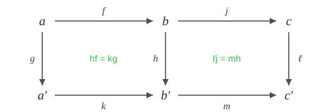
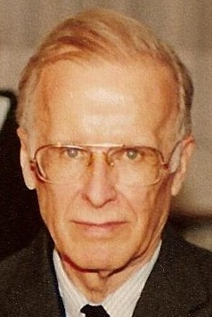
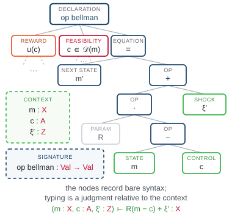
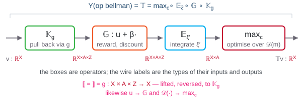
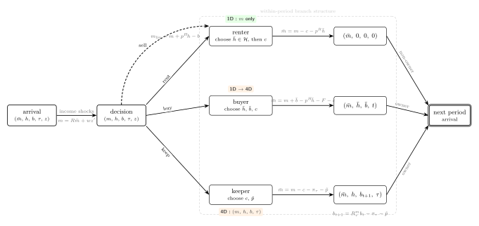

<!-- _class: title -->

<p class="title-eyebrow"><span class="keep-case">𝕋v = v</span> Reading Group</p>

# Categorical types and AGI

## Session A. Categories and Functors

<p class="title-authors">Akshay Shanker<span class="title-date">7 August 2026</span></p>

---

<!-- _class: quote -->
> "Applied category theory is information plumbing. It’s boring… but plumbers save more lives than doctors."

<p class="quote-src">DisCoPy project, "Why?" &middot; <a href="https://discopy.org/">discopy.org</a>.</p>

---

<div class="kicker p1">Part 1</div>

# Introduction

---

<div class="kicker p1">Introduction &middot; purpose and method</div>

## Objective

Sessions run over six to eight talks.

Objective: gain *sufficient* fluency in *basic* **category theory** and **type theory** to assess their utility for:

- transparency and verification in computing *applied* high-dimensional dynamic programming and reinforcement learning problems.
- efficient symbolic and rigorous model representation.
- "speaking deterministically" to AI (LLM) systems, i.e., giving AI the power to reason deterministically using relational graphs (artificial general intelligence?).

May or may not help us prove new results.

<!-- Technical material follows Riehl and draws from current research with co-authors.-->

---

<div class="kicker p2">Introduction &middot; Category theory</div>

## Category theory

- Organizes **objects** and **morphisms** with specified **domains** and **codomains**.
- Shifts focus from <span class="c-red">properties of objects</span> to <span class="c-red">relations between objects</span> and transformations of those relations.
- Simple structures that can represent structures in disparate mathematical areas — a common language.

<div class="callout"><strong>Universality.</strong> The most useful idea for us is <strong>universality</strong>: is there one simple representation of a model that fixes the ground truth for all its transformations?</div>

<!-- Speaker note: AAS give an example here-->

---

<div class="kicker p2">Introduction &middot; Type theory</div>

## Type theory

- A formal system that classifies objects by their types.
- Types classify terms (expressions) and rule out invalid compositions among them.

<!-- A **typing judgment** $\Gamma \vdash t : A$ asserts that, under the assumptions recorded in the **context** $\Gamma$ — a finite list of typed variables $x_1 : A_1, \ldots, x_n : A_n$ — the **term** $t$ has the **type** $A$. The context, the term, and the type are three different pieces of syntax; the judgment is the assertion relating them. -->

<div class="callout"><strong>Categorical type theory.</strong> A type system generates a classifying category from syntax, which records the types of objects being composed as context.
An <strong>elaboration</strong> is a structure-preserving map from that category into a <strong>semantic category</strong>. (A <strong>semantic category</strong> assigns each type and each expression its higher-order <strong>meaning</strong>.)</div>

<div class="footnote">Jacobs (1999), pp. 4–7 and Chapter 2: typed contexts and terms generate a category (judgments Γ ⊢ t : A appear in Definition 2.1.1, p. 124); interpretations are structure-preserving functors from its classifying category (Theorem 2.2.1, p. 126, where they are called models).</div>

---

<div class="kicker p3">Introduction &middot; Motivation</div>

## Why should economists care?

- The real world is complex: to analyse an applied, non-stationary DP problem rigorously, we mix and match areas of math — analysis, geometry, convex analysis, order theory, algebraic topology, etc. — and representations of the model (sequence space, recursive, stages, etc.).
- Model representations are hard to computationally encode — so economists don't bother to write what they are *actually* computing.
- Lack of transparency *is already a problem*, but compounds into a significant problem when AI assisted economic modelling comes into the picture.

Category theory can give us a *simple and common* language to formally represent *the plumbing* of a model.

<div class="callout"><strong>Overarching question.</strong> Can categorical type theory formalize structures that are otherwise too <strong>complicated</strong>, or that remain <strong>implicit</strong>, in the notation of fields like analysis, calculus, and optimisation?</div>

---

<div class="kicker p3">Introduction &middot; Motivation</div>

## Research program: Symbolic dynamic programming

Create a formal **declarative** symbolic system to write dynamic programs so that:

1. Written syntax faithfully represents the mathematical model we claim to compute.
2. Properties of the mappings from computational implementations and approximations to the mathematical model are explicit.
3. Semantics is **denotational** (what expressions mean) rather than **operational** (how a machine executes them).

<div class="flow">
  <div class="node"><span class="role">declare</span>typed syntax<br/>signature + grammar</div>
  <div class="arrow">→</div>
  <div class="node"><span class="role">organise</span>classifying category Cl(Σ)</div>
  <div class="arrow">→</div>
  <div class="node"><span class="role">elaborate</span>semantics: a graph or algebra</div>
  <div class="arrow">→</div>
  <div class="node"><span class="role">compute</span>compiled executable</div>
</div>

---

<div class="kicker p3">Introduction &middot; contents</div>

## Road-map


1. **Introduction.**
2. **Categories and functors.**
	1. Categories and diagrams
	2. Duality
	3. Functors
	4. Introduction to universality
3. **Open dynamic-programming research.**

Next talks:
- formalize universality and more interesting DP applications.
- colimits.
- types and terms.

---
<!-- _class: title -->
<!-- _paginate: false -->

<p class="title-eyebrow">Part 2</p>

# 2. Categories and functors

<p class="title-authors">2.1 Categories and diagrams &middot; 2.2 Duality &middot; 2.3 Functors &middot; 2.4 Introduction to universality</p>

---

# 2.1 Categories and diagrams

---

<div class="kicker p2">2.1 Categories and diagrams &middot; Riehl §1.1</div>

## A category

<div class="defbox">

**Definition 1.1.1.** A category consists of a collection of **objects** $X, Y, Z, \ldots$ and a collection of **morphisms** $f, g, h, \ldots$ such that each morphism has a specified domain and codomain ($f : X \to Y$), each object has an identity $\mathrm{id}_X : X \to X$, and each composable pair has a specified composite — $f : X \to Y$ and $g : Y \to Z$ yield $gf : X \to Z$ — subject to two axioms:

- **unitality**: $\mathrm{id}_Y f = f = f\, \mathrm{id}_X$ for every $f : X \to Y$;
- **associativity**: $h(gf) = (hg)f$ for every composable triple.

</div>

- Definition 1.1.1 supplies no elements, no membership relation, and no underlying sets.
- Note how the objects are recoverable from the identity morphisms (Remark 1.1.2 in Riehl), so **morphisms** take primacy.

<div class="footnote">Riehl (2016), Definition 1.1.1 and Remark 1.1.2 (pp. 3–4).</div>

---

<div class="kicker p2">2.1 Categories and diagrams &middot; Riehl §1.1</div>

## Examples of categories

Concrete categories: the objects have underlying sets, and the morphisms are structure-preserving functions.

- The objects of $\mathsf{Set}$ are sets, and its morphisms are functions.
- The objects of $\mathsf{Top}$ are topological spaces, and its morphisms are continuous maps.
- The objects of $\mathsf{Vect}_k$ are vector spaces over a field $k$, and its morphisms are linear maps.
- The objects of $\mathsf{Meas}$ are measurable spaces, and its morphisms are measurable functions.
- The objects of $\mathsf{Poset}$ are partially ordered sets, and its morphisms are order-preserving maps.

<div class="footnote">Riehl (2016), Example 1.1.3 (i), (ii), (v), (ix), (x), p. 4; concrete categories, p. 5.</div>

---

<div class="kicker p2">2.1 Categories and diagrams &middot; Riehl §1.1</div>

## Categories versus sets

In each of the examples listed in Example 1.1.3, the collection of objects is not a set (Remark 1.1.5).

<div class="defbox">

**Notation.** For objects $x, y$, write $\mathsf{C}(x, y)$ for the collection of morphisms $x \to y$.

</div>

<div class="defbox">

**Definitions 1.1.6–1.1.7.** A category is **small** if it has only a set's worth of arrows in total, and **locally small** if between any pair of objects there is only a set's worth of morphisms — that is, each $\mathsf{C}(x, y)$ is a set. Small implies locally small, because a subcollection of a set is a set. The converse fails.

</div>

- A set is known through its elements and the membership relation. A category is known through its morphisms and their composition.
- The notion of sameness in a category is isomorphism (Definition 1.1.10), not equality.

<div class="footnote">Riehl (2016), Remark 1.1.5 (p. 6); Definitions 1.1.6–1.1.7, small and locally small (p. 7).</div>

---

<div class="kicker p2">2.1 Categories and diagrams &middot; Riehl §1.1</div>

## Morphisms need not be functions

- $\mathsf{Mat}_{\mathbb{R}}$ denotes the category of real matrices. Its objects are the positive integers, a morphism $n \to m$ is an $m \times n$ real matrix, and composition is matrix multiplication.
- $\mathsf{B}M$ denotes the one-object category built from a monoid $M$, a set carrying an associative multiplication with a unit. The morphisms of the single object are the elements of $M$, and composition is the multiplication of $M$.
- A preorder $(P, \leq)$, a set with a reflexive and transitive relation, is a category with exactly one morphism $x \to y$ when $x \leq y$ and none otherwise. Transitivity supplies the composites, and reflexivity supplies the identities.

<div class="footnote">Riehl (2016), Example 1.1.4 (i)–(iii), pp. 5–6.</div>

---

<div class="kicker p2">2.1 Categories and diagrams &middot; Riehl §1.1</div>

## Isomorphism

<div class="defbox">

**Definition 1.1.10.** A morphism $f : X \to Y$ is an **isomorphism** when there exists $g : Y \to X$ with $gf = \mathrm{id}_X$ and $fg = \mathrm{id}_Y$; the objects are then isomorphic, $X \cong Y$.

</div>

**Examples 1.1.11.**

- In $\mathsf{Set}$, the isomorphisms are the bijections.
- In $\mathsf{Top}$, the category whose objects are topological spaces and whose morphisms are continuous maps (Example 1.1.3(ii)), the isomorphisms are the **homeomorphisms**. Definition 1.1.10 requires the inverse to be a morphism of the same category, so the inverse must itself be continuous, and a continuous bijection can fail to have a continuous inverse. Wrapping a half-open interval once around a circle is a continuous bijection whose inverse is discontinuous at the point where the ends meet, so interval and circle are isomorphic in $\mathsf{Set}$ but not in $\mathsf{Top}$.
	<!-- Author note: whether two objects count as the same is decided by the ambient category, the category in which the objects live, not by the objects' underlying sets. -->
- In a poset, the only isomorphisms are the identities, which is the categorical statement of antisymmetry.

<div class="footnote">Riehl (2016), Definition 1.1.10 and Example 1.1.11 (i), (iii), (v), §1.1, pp. 7–8; Top as Example 1.1.3(ii), p. 4.</div>

---

<!-- _class: quote -->

> "A category provides a context in which to answer the question 'When is one thing the same as another thing?'"

<p class="quote-src">Riehl (2016), <em>Category Theory in Context</em>, §1.1, p. 7.</p>

---

<div class="kicker p2">2.1 Functors &middot; Riehl §§1.3, 1.5</div>

## Functors

<div class="defbox">

**Definition 1.3.1.** A functor $F : \mathsf{C} \to \mathsf{D}$ assigns an object $Fc$ to each object $c$ and a morphism $Ff : Fc \to Fc'$ to each $f : c \to c'$, preserving the structure: $Fg \cdot Ff = F(gf)$ and $F(\mathrm{id}_c) = \mathrm{id}_{Fc}$.

</div>

**Examples 1.3.2.** The forgetful functor $U : \mathsf{Vect}_k \to \mathsf{Set}$ sends a vector space to its underlying set.

</br>

<div class="defbox">

**Definition 1.5.7 (faithful).** A functor $F : \mathsf{C} \to \mathsf{D}$ is **faithful** if for each pair of objects $x, y$ of $\mathsf{C}$, the map $f \mapsto Ff : \mathsf{C}(x, y) \to \mathsf{D}(Fx, Fy)$ is injective.

</div>

<br/>

Note the forgetful functor $U$ above is faithful, since two linear maps with the same underlying function are equal.

<!--Faithfulness is a condition on each **hom-set** separately, and a faithful functor need not be injective on morphisms globally.-->

<!--The free functor $F : \mathsf{Set} \to \mathsf{Group}$ sends a set to the free group on it, whose elements are the reduced words in the set's elements and their formal inverses.-->


<div class="footnote">Riehl (2016), Definition 1.3.1 and Example 1.3.2, §1.3, pp. 14–16; Definition 1.5.7 and Remark 1.5.8, p. 32.</div>

---

<div class="kicker p2">2.1 Functors &middot; Riehl §1.3</div>

## Functors

**Examples 1.3.2.**

- **The chain rule is functoriality.** Let $\mathsf{Euclid}_*$ be the category whose objects are pairs $(\mathbb{R}^n, a)$, a Euclidean space with a chosen point, and whose morphisms $(\mathbb{R}^n, a) \to (\mathbb{R}^m, b)$ are the differentiable $f$ with $f(a) = b$. Sending $(\mathbb{R}^n, a)$ to $n$ and $f$ to its Jacobian matrix at $a$ defines a functor $D : \mathsf{Euclid}_* \to \mathsf{Mat}_{\mathbb{R}}$, where $\mathsf{Mat}_{\mathbb{R}}$ is the matrix category defined earlier. Identities go to identity matrices, and composition in $\mathsf{Mat}_{\mathbb{R}}$ is matrix multiplication, so the composition axiom of Definition 1.3.1 becomes the chain rule $D(g \circ f)_a = Dg_{f(a)} \cdot Df_a$.
<div class="footnote">Riehl (2016), Example 1.3.2 (x), §1.3, pp. 15–16.</div>

---

<div class="kicker p2">2.1 Categories and diagrams &middot; Riehl §1.6</div>

## Diagrams

<div class="defbox">

**Definition 1.6.4.** A **diagram** in a category $\mathsf{C}$ is a functor $F : \mathsf{J} \to \mathsf{C}$; the domain $\mathsf{J}$ is called the indexing category of the diagram.

</div>

A **quiver** is a directed graph that may contain loops and parallel arrows.
- The objects and morphisms of a category form a quiver, and every finite directed path in it has a specified composite, well defined by the associativity axiom of Definition 1.1.1 (pp. 3–4).


<div class="footnote">Riehl (2016), §1.1: quivers, paths, and their composites, pp. 3–4; §1.6: commuting paths and the triangle (1.6.1), p. 39; Definition 1.6.4, p. 40.</div>

---

<div class="kicker p2">2.1 Categories and diagrams &middot; Riehl §1.6</div>

## Simple diagrams

<div class="cols">
<div class="center">


The indexing category has two objects and one arrow, $1 \to 2$. A diagram of this shape in $\mathsf{C}$ is a choice of one morphism $f : x \to y$.

</div>
<div class="center">


The indexing category is the poset $1 \leq 2 \leq 3$. A diagram of this shape is a **commutative triangle**: functoriality sends the arrow $1 \to 3$ to the composite $gf$, so the diagonal agrees with the two-step path.

</div>
</div>

<div class="footnote">Riehl (2016), §1.6: the commuting triangle (1.6.1), p. 39; Definition 1.6.4, p. 40.</div>

---

<div class="kicker p2">2.1 Categories and diagrams &middot; Riehl §1.6</div>

## Commutative diagrams

A square indexed by $2 \times 2$ (Example 1.6.6, Remark 1.6.7) commutes when $hf = kg$:

<div class="center">



</div>

<div class="defbox">

**Lemma 1.6.5.** Functors preserve commutative diagrams.

</div>

**Proof.** A diagram in $\mathsf{C}$ is a functor $F : \mathsf{J} \to \mathsf{C}$ (Definition 1.6.4); for any functor $G : \mathsf{C} \to \mathsf{D}$, the composite $GF : \mathsf{J} \to \mathsf{D}$ defines the image of the diagram in $\mathsf{D}$. $\blacksquare$

<div class="footnote">Riehl (2016), Example 1.6.6 and Remark 1.6.7 — the square with hf = kg, p. 41; Lemma 1.6.5 with proof, p. 41.</div>

---

<div class="kicker p2">2.1 Categories and diagrams &middot; Riehl §1.6</div>

## A diagram chase

<div class="defbox">

**Lemma 1.6.11.** If, inside a composable path $f_n, \ldots, f_1$, a segment satisfies $f_k \cdots f_i = g_m \cdots g_1$, then $f_n \cdots f_1 = f_n \cdots f_{k+1}\, g_m \cdots g_1\, f_{i-1} \cdots f_1$.

</div>

**Proof.** Composition is well-defined: if two composites define the same arrow, then pre- and postcomposing each with the same sequences of arrows again gives the same arrow. $\blacksquare$

<div class="footnote">Riehl (2016), §1.6: Lemma 1.6.11 with proof, pp. 42–43; the section's epigraph is Eilenberg–Steenrod on diagrams, p. 39.</div>

---

<div class="kicker p2">2.1 Categories and diagrams &middot; Riehl §1.6</div>

## Minimal subdiagrams

A diagram drawn as a **simple acyclic quiver** (the quiver represents a poset category) has
- at most one edge between any two vertices, no directed cycles;
- all paths with a common source and target agree.

Lemma 1.6.11 then reduces commutativity of the whole diagram to that of its **minimal subdiagrams** — for the cube $2\times2\times2$, the six faces:

<div class="center">



</div>

<div class="footnote">Riehl (2016), §1.6: minimal subdiagrams and the commutative cube, p. 43.</div>

---

<div class="kicker p2">2.1 Categories and diagrams &middot; Riehl §1.6</div>

## Pasting squares

**Example (pasting, diagram 1.6.10).** Suppose the two inner squares commute, $hf = kg$ and $\ell j = mh$. Then the outer rectangle commutes, $\ell(jf) = (mk)g$:

<div class="center">



</div>

**Chase.** $\ell j f = (mh)f$ — substitute $\ell j = mh$ (Lemma 1.6.11); $= m(hf)$ — associativity (Definition 1.1.1); $= m(kg)$ — substitute $hf = kg$ (Lemma 1.6.11); $= (mk)g$ — associativity. $\blacksquare$

<div class="footnote">Riehl (2016), §1.6: the two-squares-make-a-rectangle diagram (1.6.10), p. 42.</div>

---

<div class="kicker p2">2.1 Categories and diagrams &middot; example</div>

## Buffer stock model with income growth

Consider a **standard** consumption–saving problem under perfect foresight, with parameters $R$ (return factor), $\beta$ (discount), $\gamma > 1$ (CRRA), and income growth factor $G$.
- Define the **absolute patience factor** $\text{Þ} := (R\beta)^{1/\gamma}$.
- Assume $G < R$.

**Diagram.** Objects are the model's parametric factors:
- an arrow $x \to y$ asserts $x < y$;
- arrows compose by transitivity.

<div class="footnote">Carroll and Shanker (2026), Theoretical Foundations of Buffer Stock Saving.</div>

---

<div class="kicker p2">2.1 Categories and diagrams &middot; proof by diagram</div>

## Proof by diagram

**Claim.** Assume $G < R$. Then $\text{Þ} < G \;\Rightarrow\; \text{Þ} < R^{1/\gamma}G^{1-1/\gamma} \;\Rightarrow\; \text{Þ} < R$.

<div class="cols">
<div>

**Proof** (by composition, on the diagram).
- $G < R$ gives the two right-hand arrows, $G \to R^{1/\gamma}G^{1-1/\gamma}$ and $R^{1/\gamma}G^{1-1/\gamma} \to R$: each is equivalent to $G < R$.
- Given the top arrow $\text{Þ} \to G$, pasting gives $\text{Þ} \to R^{1/\gamma}G^{1-1/\gamma}$.
- Pasting once more gives $\text{Þ} \to R$. $\blacksquare$

</div>
<div class="center">


</div>
</div>

<div class="footnote">Carroll and Shanker (2026), Theoretical Foundations of Buffer Stock Saving: Claim 2, Appendix A.2 (Equation 53); Figure 7. In the paper's terminology, Þ &lt; G is growth impatience, Þ &lt; R return impatience, G &lt; R finite human wealth, and Þ &lt; R^(1/γ)G^(1−1/γ) perfect-foresight finite value of autarky.</div>

---

# 2.2 Duality

---

<div class="kicker p2">2.2 Duality &middot; Riehl §1.2</div>

## Duality through the opposite category

<div class="defbox">

**Definition 1.2.1.** The opposite category $\mathsf{C}^{\mathrm{op}}$ has the same objects as $\mathsf{C}$ and, for each morphism $f : x \to y$ between objects $x$ and $y$ of $\mathsf{C}$, a morphism $f^{\mathrm{op}} : y \to x$, with composites $f^{\mathrm{op}} g^{\mathrm{op}} = (gf)^{\mathrm{op}}$. From here on objects are written in lowercase, following Riehl §1.2.

</div>

**The duality principle.**
- A theorem of the form "for all categories $\mathsf{C}$, a given statement holds" applies, in particular, to every opposite category $\mathsf{C}^{\mathrm{op}}$.
- Re-expressing a conclusion in terms of the data of $\mathsf{C}$ reverses the direction of every morphism and the order of every composite.
- The re-expressed statement is the dual statement, and the re-expressed proof is the dual proof — "a two-for-one deal: any proof in category theory simultaneously proves two theorems" (p. 10).

<div class="footnote">Riehl (2016), Definition 1.2.1 (p. 9); the duality principle and the two-for-one description (p. 10).</div>

---

<div class="kicker p2">2.2 Duality &middot; Riehl §1.2, Exercise 1.2.vii</div>

## Exercise 1.2.vii

<div class="defbox">

**Exercise 1.2.vii** (Riehl, verbatim). Regarding a poset $(P, \leq)$ as a category, define the supremum of a subcollection of objects $A \subset P$ in such a way that the dual statement defines the infimum. Prove that the supremum of a subset of objects is unique, whenever it exists, in such a way that the dual proof demonstrates the uniqueness of the infimum.

</div>
<br/>
<br/>

**Notation.** $(P, \leq)$ is the category with a unique morphism $x \to y$ exactly when $x \leq y$ (Example 1.1.4(iii)), and the subcollection is $A$ with $A \subseteq P$.

<div class="footnote">Riehl (2016), Exercise 1.2.vii (pp. 13–14).</div>

---

<div class="kicker p2">2.2 Duality &middot; Riehl §1.2, Exercise 1.2.vii</div>

## Supremum of a poset

<div class="defbox">

**Definition.** An object $s$ is a **supremum** of $A$ when:

- (i) for every $a \in A$ there is a morphism $a \to s$, and
- (ii) for every $u$ with a morphism $a \to u$ for each $a \in A$, there is a morphism $s \to u$.

</div>

<!--The two conditions mention morphisms only, never the symbol $\leq$.
- the **duality principle** reads the same conditions in $P^{\mathrm{op}}$, reversing every arrow.-->

<br/>

**The opposite poset.** By Definition 1.2.1, $P^{\mathrm{op}}$ has the same elements as $P$, and it has a morphism $x \to y$ exactly when $P$ has a morphism $y \to x$. It follows that $P^{\mathrm{op}}$ is $(P, \geq)$.

> Note that $P^{\mathrm{op}}$ is the poset $P$ with its order $\leq$ reversed.

<div class="footnote">Riehl (2016): Example 1.1.4(iii), posets as categories; Example 1.2.2(ii) and the duality principle, p. 10. For A = ∅, condition (i) is vacuous and every u is an upper bound, so a supremum of ∅ is a least element of P. Conditions (i)–(ii) are a universal property, the shape Chapter 2 studies in general; in the language of Chapter 3, the supremum is the colimit of the collection A.</div>

---

<div class="kicker p2">2.2 Duality &middot; Riehl §1.2, Exercise 1.2.vii</div>

## The dual statement: infimum

<div class="defbox">

**Dual statement.** An object $i$ is a supremum of $A$ in $P^{\mathrm{op}}$ when: (i) for every $a \in A$ there is a morphism $a \to i$ in $P^{\mathrm{op}}$; (ii) for every $u$ with a morphism $a \to u$ in $P^{\mathrm{op}}$ for each $a \in A$, there is a morphism $i \to u$ in $P^{\mathrm{op}}$.

</div>

Every arrow translates as $x \to y$ in $P^{\mathrm{op}}$ means $y \leq x$ in $P$. Thus, the dual statement for $i$ implies:

- (i) $i$ is a lower bound of $A$, and
- (ii) for every lower bound $u$ of $A$, we have $u \leq i$.

It follows that $i$ is the infimum of $A$.

Since $P^{\mathrm{op}}$ is again a poset, the uniqueness proof for suprema applies to it verbatim; the result, once read in $P$, then says that the infimum is unique.


<div class="footnote">Riehl (2016), Exercise 1.2.vii (pp. 13–14); the reversed order of P<sup>op</sup> is Example 1.2.2(ii) (p. 10).</div>

---

<div class="kicker p2">2.2 Duality &middot; Riehl §1.2, Exercise 1.2.vii</div>

## Uniqueness of the supremum

<div class="defbox">

**Proposition.** If $s$ and $s'$ are both suprema of $A \subseteq P$, then $s = s'$.

</div>

<style scoped>
p { font-size: 20px; margin: 0 0 0.55em 0; }
</style>

**Proof.** Assume $s$ and $s'$ each satisfy conditions (i) and (ii) of the definition of the supremum.

**Step 1.** By condition (i), applied to $s$ and to $s'$ in turn, each of $s$ and $s'$ is an upper bound of $A$.

**Step 2.** Condition (ii) for $s'$, applied to the upper bound $s$ produced by Step 1, yields a morphism $f : s' \to s$.

**Step 3.** Condition (ii) for $s$, applied to the upper bound $s'$ produced by Step 1, yields a morphism $g : s \to s'$.

**Step 4.** By Definition 1.1.1 the composites $fg : s \to s$ and $gf : s' \to s'$ exist. A preorder, and in particular a poset, has at most one morphism between any two objects, and $\mathrm{id}_s \in P(s, s)$ by Definition 1.1.1; hence $fg = \mathrm{id}_s$ and $gf = \mathrm{id}_{s'}$. These are the equations of Definition 1.1.10, so $f : s' \to s$ is an **isomorphism** with inverse $g$, and $s \cong s'$.

**Step 5.** In a poset the only isomorphisms are the identities, which is the categorical statement of antisymmetry (Example 1.1.11(v)); the isomorphism of Step 4 is thus an identity, and $s = s'$. $\blacksquare$

<div class="footnote">Riehl (2016), Exercise 1.2.vii (pp. 13–14); Example 1.1.11(v), p. 8, for the isomorphisms of a poset. Reading Steps 1–5 in P<sup>op</sup> proves, word for word, that the infimum is unique; Example 1.1.4(iii) and Example 1.1.11(v) are self-dual, so the dual proof needs no adjustment.</div>

---

<div class="kicker p2">2.2 Duality &middot; Riehl §1.2</div>

## Lemma 1.2.3

<div class="defbox">

**Lemma 1.2.3.** For $f : x \to y$ in $\mathsf{C}$ the following are equivalent: (i) $f$ is an isomorphism; (ii) for every object $c$, postcomposition $f_{*} : \mathsf{C}(c, x) \to \mathsf{C}(c, y)$, $h \mapsto f h$, is a bijection; (iii) for every object $c$, precomposition $f^{*} : \mathsf{C}(y, c) \to \mathsf{C}(x, c)$, $k \mapsto k f$, is a bijection.

</div>

<div class="cols">
<div class="center">


<div class="small"><strong>postcomposition</strong> <em>f</em><sub>*</sub> composes <em>f</em> after an arrow <em>h</em> into the domain</div>

</div>
<div class="center">


<div class="small"><strong>precomposition</strong> <em>f</em><sup>*</sup> composes <em>f</em> before an arrow <em>k</em> out of the codomain</div>

</div>
</div>

<div class="footnote">Riehl (2016), Lemma 1.2.3 (p. 11).</div>

---

<div class="kicker p2">2.2 Duality &middot; Riehl §1.2</div>

## Applying duality to Lemma 1.2.3

Riehl proves (i) ⇔ (ii) directly (pp. 11–12; not reproduced here) and obtains (i) ⇔ (iii) by duality.

- (i) ⇔ (ii) holds in every category, hence in $\mathsf{C}^{\mathrm{op}}$. Applied to $f^{\mathrm{op}} : y \to x$, it says $f^{\mathrm{op}}$ is an isomorphism if and only if postcomposition by $f^{\mathrm{op}}$, $\mathsf{C}^{\mathrm{op}}(c, y) \to \mathsf{C}^{\mathrm{op}}(c, x)$, is a bijection for every $c$.
- Translate back to $\mathsf{C}$. A morphism $c \to y$ of $\mathsf{C}^{\mathrm{op}}$ is a morphism $y \to c$ of $\mathsf{C}$, so the two hom-sets are $\mathsf{C}(y, c)$ and $\mathsf{C}(x, c)$; and since $f^{\mathrm{op}} k^{\mathrm{op}} = (kf)^{\mathrm{op}}$, postcomposition by $f^{\mathrm{op}}$ acts as $k \mapsto kf$, the precomposition $f^{*}$.
- $f^{\mathrm{op}}$ is an isomorphism exactly when $f$ is, because the two inverse equations reverse into each other. The translated statement is then (i) ⇔ (iii).

<div class="footnote">Riehl (2016), Lemma 1.2.3 and Remark 1.2.4 (p. 11); proof of Lemma 1.2.3, pp. 11–12 — the translated display is (1.2.6), and "the notion of isomorphism, as defined in 1.1.10, is self-dual".</div>

---

<div class="kicker p2">2.2 Duality &middot; Riehl §1.2</div>

## Monomorphisms

Definitions dualize as theorems do.

<div class="defbox">

**Definition 1.2.7 (monomorphism).** A morphism $f : x \to y$ in a category $\mathsf{C}$ is a **monomorphism** if for every object $w$ and every parallel pair $h, k : w \to x$, $fh = fk$ implies $h = k$.

</div>

<div class="center">


</div>

$$fh = fk \;\Longrightarrow\; h = k$$

<div class="footnote">Riehl (2016), Definition 1.2.7 with the parallel-pair quantifiers (p. 12).</div>

---

<div class="kicker p2">2.2 Duality &middot; Riehl §1.2</div>

## Epimorphisms

<div class="defbox">

**Definition 1.2.7 (epimorphism).** A morphism $f : x \to y$ in a category $\mathsf{C}$ is an **epimorphism** if for every object $z$ and every parallel pair $h, k : y \to z$, $hf = kf$ implies $h = k$.

</div>

<div class="center">


</div>

$$hf = kf \;\Longrightarrow\; h = k$$

<div class="footnote">Riehl (2016), Definition 1.2.7 with the parallel-pair quantifiers (p. 12).</div>

---

<div class="kicker p2">2.2 Duality &middot; Riehl §1.2</div>

## Duality for monomorphisms and epimorphisms

<div class="defbox">

**Proposition.** Let $f : x \to y$ be a morphism of $\mathsf{C}$. Then $f$ is a monomorphism in $\mathsf{C}$ if and only if $f^{\mathrm{op}} : y \to x$ is an epimorphism in $\mathsf{C}^{\mathrm{op}}$, and $f$ is an epimorphism in $\mathsf{C}$ if and only if $f^{\mathrm{op}}$ is a monomorphism in $\mathsf{C}^{\mathrm{op}}$.

</div>

**Proof. Step 1.** By Definition 1.2.1, $h \mapsto h^{\mathrm{op}}$ matches each parallel pair $h, k : w \to x$ in $\mathsf{C}$ with a parallel pair $h^{\mathrm{op}}, k^{\mathrm{op}} : x \to w$ in $\mathsf{C}^{\mathrm{op}}$, every such pair arises this way, and $h = k$ exactly when $h^{\mathrm{op}} = k^{\mathrm{op}}$.

**Step 2.** The composition rule of Definition 1.2.1 gives $(fh)^{\mathrm{op}} = h^{\mathrm{op}} f^{\mathrm{op}}$, and likewise for $k$, so $fh = fk$ in $\mathsf{C}$ exactly when $h^{\mathrm{op}} f^{\mathrm{op}} = k^{\mathrm{op}} f^{\mathrm{op}}$ in $\mathsf{C}^{\mathrm{op}}$.

**Step 3.** Substituting Steps 1 and 2 into Definition 1.2.7, the condition "$fh = fk$ implies $h = k$, for every parallel pair" in $\mathsf{C}$ becomes "$h^{\mathrm{op}} f^{\mathrm{op}} = k^{\mathrm{op}} f^{\mathrm{op}}$ implies $h^{\mathrm{op}} = k^{\mathrm{op}}$, for every parallel pair" in $\mathsf{C}^{\mathrm{op}}$, and these are the definitions of "$f$ is a monomorphism" and "$f^{\mathrm{op}}$ is an epimorphism"; this proves the first equivalence.

**Step 4.** Apply the first equivalence in $\mathsf{C}^{\mathrm{op}}$, whose opposite category is $\mathsf{C}$ (Definition 1.2.1 applied twice), with $f^{\mathrm{op}}$ in place of $f$; the second equivalence follows. $\blacksquare$

<div class="footnote">Riehl (2016), the duality clause following Definition 1.2.7 (p. 12); Definition 1.2.1 (pp. 9–10).</div>

---

<div class="kicker p2">2.2 Duality &middot; Riehl §1.2</div>

## Monomorphisms and epimorphisms in Set

**Example 1.2.8.** In $\mathsf{Set}$, the monomorphisms are the injections and the epimorphisms are the surjections.

<br/>

**The axiom of choice.**
- A **section** of $f : X \to Y$ is a right inverse, a function $s : Y \to X$ with $f \circ s = \mathrm{id}_Y$. Only a surjection can have a section, since $f \circ s = \mathrm{id}_Y$ makes $f$ onto.
- The axiom of choice is equivalent to the assertion that **every surjection admits a section**, since a section chooses one element of $f^{-1}(y)$ for each $y$.
- In $\mathsf{Set}$ the epimorphisms are the surjections (Example 1.2.8), and an epimorphism admitting a section is called **split**.
- The axiom of choice therefore says that **every epimorphism in $\mathsf{Set}$ is split**.


<div class="footnote">Riehl (2016), Examples 1.2.8 and 1.2.9 (p. 12), Remark 1.2.10 (p. 13), §1.2.</div>

---

# 2.4 Introduction to universality

---

<div class="kicker p2">2.4 Introduction to universality &middot; Riehl §1.3</div>

## The first lemma of category theory

<div class="defbox">

**Lemma 1.3.8.** *Functors preserve isomorphisms.*

</div>

**Proof.** The proof uses Definition 1.1.10 (isomorphism and inverse) and the two functoriality axioms of Definition 1.3.1.

Let $F : \mathsf{C} \to \mathsf{D}$ be a functor and $f : x \to y$ an isomorphism with inverse $g : y \to x$ (Definition 1.1.10). Then

$$Fg \cdot Ff \;=\; F(gf) \;=\; F(\mathrm{id}_x) \;=\; \mathrm{id}_{Fx},$$

the first equality by the composition axiom of Definition 1.3.1, the second because $gf = \mathrm{id}_x$ (Definition 1.1.10), the third by the identity axiom of Definition 1.3.1. So $Fg$ is a left inverse of $Ff$; exchanging the roles of $f$ and $g$ in the same three equalities gives $Ff \cdot Fg = \mathrm{id}_{Fy}$, so the inverse is two-sided and $Ff$ is an isomorphism (Definition 1.1.10). $\blacksquare$

<div class="footnote">Riehl (2016), Lemma 1.3.8 with proof, §1.3, p. 19. The lemma appears immediately after functors are first defined in Eilenberg–Mac Lane (1942) — "arguably the first lemma in category theory" (Riehl).</div>

---

<div class="kicker p2">2.4 Introduction to universality &middot; Riehl §1.3</div>

## Consequences of the first lemma

The first lemma says that functors preserve isomorphisms, and the introduction defined an **elaboration** of a typed system as a structure-preserving functor from its classifying category.
- Together they imply that every interpretation carries each isomorphism of the classifying category to an isomorphism of the semantics.
- This is the first instance of the pattern we want to exploit.
	- A relational property established once in a simpler setting (say, declarative syntax) transfers to every interpretation.


---

<div class="kicker p2">2.4 Introduction to universality &middot; Riehl §2.1</div>

## Prelude to universality: category of dynamical systems

<div class="defbox">

**The category of discrete dynamical systems** (Riehl, Examples 2.1.1 and 2.4.11). An object, called a **discrete dynamical system**, is a triple $(X, f, x_0)$, with a set $X$, a function $f : X \to X$, and a distinguished element $x_0 \in X$. A morphism $\varphi : (X, f, x_0) \to (Y, g, y_0)$ is a function $\varphi : X \to Y$ with (i) $\varphi \circ f = g \circ \varphi$, and (ii) $\varphi(x_0) = y_0$. Both conditions hold for identities and survive composition, thus the collection of these objects and morphisms defines a category.

</div>

- The equation $\varphi \circ f = g \circ \varphi$ is a commutative square: $\varphi$ carries one step of $f$ to one step of $g$.
- The perfect-foresight buffer-stock model of the earlier example, with a fixed consumption policy $c$ satisfying $c(m) \leq m$, is an object of this category: $X = \mathbb{R}_{+}$ holds market resources $m$, the law of motion is $f(m) = (R/G)\,(m - c(m)) + 1$, and $x_0 = m_0$.

<div class="footnote">Riehl (2016), Example 2.1.1 (pp. 53–54); the same category returns as Example 2.4.11 (p. 75). The category is large: its objects do not form a set (Remark 1.1.5, p. 6).</div>

---

<div class="kicker p2">2.4 Introduction to universality &middot; Riehl §2.1</div>

## Prelude to universality: the natural numbers

<div class="defbox">

**A universal property of the natural numbers** (Riehl, Example 2.1.1). The triple $(\mathbb{N}, s, 0)$, with the successor function $s(n) = n + 1$, is itself a discrete dynamical system, and for every discrete dynamical system $(X, f, x_0)$ there is exactly one morphism $r : (\mathbb{N}, s, 0) \to (X, f, x_0)$.

</div>

- Preserving the structure imposes two equations, $r(0) = x_0$ and $r(n+1) = f(r(n))$, which say $r$ is a solution path of the difference equation $x_{n+1} = f(x_n)$ started at $x_0$. So $r(n) = f^{n}(x_0)$, and a morphism out of $(\mathbb{N}, s, 0)$ is a trajectory.
- Existence of $r$ is definition by recursion, since iterating $f$ from $x_0$ defines a function on all of $\mathbb{N}$. Uniqueness is induction, since two paths obeying the same law from the same start agree at $0$ and, agreeing at $n$, at $n+1$.

---

<div class="kicker p2">2.4 Introduction to universality &middot; Riehl §2.1</div>

## Prelude to universality: the natural numbers

<div class="callout sm">

**Universality.** For dynamical systems, the one representation that fixes the ground truth for all transformations is $(\mathbb{N}, s, 0)$, whose outgoing morphisms are trajectories. Our research objective is to define **natural** diagrams for broader classes of stochastic and branching systems.

</div>

<div class="footnote">Riehl (2016), Example 2.1.1 and diagram (2.1.2), pp. 53–55; "universal" is made precise in Chapter 2 as initial or terminal (p. 54).</div>

---

<!-- _class: title -->
<!-- _paginate: false -->

<p class="title-eyebrow">Part 3</p>

# 3. Dynamic-programming research

<p class="title-authors">Grammar &middot; Syntax trees &middot; Binding &middot; Elaboration</p>

---

<div class="kicker p1">Application &middot; grammar</div>

## Context-free grammar

<div class="cols">
<div class="center">


<div class="small" style="margin-top:8px;"><strong>Pāṇini</strong>, c. 4th century BCE<br/><span class="cmt">the <em>Aṣṭādhyāyī</em></span></div>

</div>
<div class="center">



<div class="small" style="margin-top:8px;"><strong>John Backus</strong>, 1924–2007<br/><span class="cmt">creator of Fortran; proponent of functional programming</span></div>

</div>
</div>

<div class="sp-s"></div>

<div class="callout sm">A context-free grammar is a finite set of rewrite rules applied <em>recursively</em> to generate every well-formed expression of a language, each rule applying independently of surrounding context. Programming languages are parsed using a grammar (with some context) into syntax trees, and then interpreted and compiled.</div>

<div class="footnote">Ingerman (<em>CACM</em> 10(3), 1967) proposed "Pāṇini–Backus form" as the fairer name &middot; Penn &amp; Kiparsky, "On Pāṇini and the Generative Capacity of Contextualized Replacement Systems," <em>COLING 2012</em>, 943–950 — <a href="https://aclanthology.org/C12-2092/">aclanthology.org/C12-2092</a> &middot; images: Wikimedia Commons</div>

---

<div class="kicker p1">Application &middot; grammar</div>

## Syntax trees

Parsing the Python line

```python
v = u(c) + beta * w
```

applies one grammar rule at each node of a tree; the leaves, read left to right, return the tokens of the source line.

<div class="center">


</div>

<div class="footnote">The tree is Python's own abstract syntax tree (AST): ast.parse("v = u(c) + beta * w"), with the ast module's node names Assign, Name, BinOp, Call.</div>

---

<div class="kicker p1">Application &middot; the buffer-stock example</div>

## First-order syntax for the Bellman operator

Now consider the following Bellman operator:

<style scoped>
.cols ul { font-size: 20px; line-height: 1.5; margin: 0.3em 0 0 0; padding-left: 1.2em; }
.cols li { margin: 0 0 0.55em 0; }
.katex-display { margin: 0.5em 0 0.9em !important; }
</style>

$$v(m) \;=\; \max_{c \,\in\, \mathcal{D}(m)} \Big\{\, u(c) \;+\; \beta\, \mathbb{E}_{\xi'}\, v\big(R(m-c)+\xi'\big) \Big\} \qquad\text{i.e.}\qquad v = \mathbb{T}\,v$$

<div class="cols">
<div>

- $X$ is the state space; $m \in X$ is current resources.
- $A$ is the choice space; $\mathcal{D}(m) \subseteq A$ is the feasible set at $m$; $c \in \mathcal{D}(m)$ is consumption.
- $Z$ is the shock space; $\xi' \in Z$ is the next-period income shock with a fixed law on $Z$; $\mathbb{E}_{\xi'}$ is expectation under that law.

</div>
<div>

- $g : X \times A \times Z \to X$ with $g(m, c, \xi') = R(m-c) + \xi'$ is the transition; $R > 0$ is the gross return factor.
- $u : A \to \mathbb{R}$ is one-period utility; $\beta \in (0,1)$ is the discount factor.
- $v$ is a candidate value function in $\mathbb{R}^X$, the bounded measurable functions on $X$.

</div>
</div>

---

<div class="kicker p1">Application &middot; the buffer-stock example</div>

## Syntax for the Bellman operator


Formally, let $v \in \mathcal{B}_{\varphi}(X)$, the space of measurable functions on $X$ bounded by a weight $\varphi$, and define $\mathbb{T}$ by evaluation:

$$(\mathbb{T}v)(m) \;=\; \max_{c \,\in\, \mathcal{D}(m)} \Big\{\, u(c) \;+\; \beta\, \mathbb{E}_{\xi'}\, v\big(R(m-c)+\xi'\big) \Big\} \qquad\forall m \in X$$

This is the correct Bellman operator, and its properties are critical to understanding the economic problem. Can we write it out in abstract syntax so that no information is lost when we parse? **No.**

<div class="callout sm">

**"But I wrote the Bellman operator in Python."** A `def T(v)` on arrays is a different object, a procedure $\hat{T} : \mathbb{R}^N \to \mathbb{R}^N$ on a grid of $N$ points, and its syntax tree contains only the node kinds of the syntax-tree slide, assignments, calls, and loops over floats. That the grid stands for $X$, the loop for $\mathbb{E}_{\xi'}$, and the procedure for $\mathbb{T}$ appears nowhere in the program text, so the claim "this code computes $\mathbb{T}v$" cannot be checked mechanically. <span class="c-red">We **trust** that the author has coded the operator faithfully to the one written in the paper.</span>

</div>


---

<div class="kicker p1">Application &middot; the buffer-stock example</div>

## First-order syntax for the Bellman operator

Call a map **higher-order** when it takes a function as an input or returns one as an output, and call syntax **first-order** when functions are not themselves inputs or outputs of the parsed expressions.

A parser produces an **abstract syntax tree** (AST): one syntax tree built from the grammar's constructors.

- An AST *cannot* represent bound variables.
- Higher order requires some context.

<div class="sp-s"></div>

<div class="callout">

How can first-order typed syntax, in which functions are never inputs or outputs, represent the higher-order map $\mathbb{T} : v \mapsto \mathbb{T}v$?

</div>

<div class="footnote">Goguen, Thatcher, Wagner, and Wright (1977), Proposition 2.1: the well-formed expressions (trees) of each type form the carriers of the term algebra.</div>

---

<div class="kicker p1">Application &middot; binding</div>

## An AST cannot represent bound variables

<style scoped>
.binding-layout {
  display: grid;
  grid-template-columns: 330px 1fr;
  gap: 1.4em;
  align-items: center;
  margin-top: 0.15em;
}
.binding-source-label {
  margin: 0 0 0.4em 0.2em;
  color: var(--ark-grey);
  font-size: 14px;
  font-weight: 500;
  letter-spacing: 0.03em;
  text-transform: uppercase;
}
.perch-legend {
  margin: -0.1em 0 0.55em 0.2em;
  color: var(--ark-grey);
  font-size: 15px;
}
.perch-legend code { font-size: 15px; }
.bellman-source {
  margin: 0;
  font-size: 16px;
  line-height: 1.45;
}
.binding-diagram { transform: translateX(14px); }
.bind-c { color: var(--ark-red); font-weight: 500; }
.bind-xi { color: #0b7fae; font-weight: 500; }
.free-m { color: #2f8f3d; font-weight: 500; }
.type-expr { color: var(--ark-red); font-weight: 500; }
</style>

<div class="binding-layout">
<div>

<div class="binding-source-label">Normalized symbolic source</div>
<div class="perch-legend"><code>Val[>]</code> is continuation; <code>Val[~]</code> is decision.</div>

<pre class="bellman-source"><code>op bellman(v : <span class="type-expr">Val[>]</span>) : <span class="type-expr">Val[~]</span> {
  v(<span class="free-m">m</span>) =
    <span class="bind-c">max</span>_{<span class="bind-c">c</span> ∈ D(<span class="free-m">m</span>)} {
      u(<span class="bind-c">c</span>) + β <span class="bind-xi">E</span>_{<span class="bind-xi">ξ′</span>}[
        v(g(<span class="free-m">m</span>, <span class="bind-c">c</span>, <span class="bind-xi">ξ′</span>))
      ]
    }
}</code></pre>

</div>
<div class="binding-diagram">


</div>
</div>

With binding edges, above is a **category**, typed by its *context* — an AST carries no binding relation.

For the **higher-order** functional equations of dynamic programming there is no formal system of binding at all, so the step from equations to solver code has no formal **semantics** (concretely, there is no object called $\mathbb{T}$ in <code>DYNARE</code> that one can point to and inspect); we want such relations formalized.

<div class="footnote">Higher-order abstract syntax: Pfenning–Elliott (1988); abstract syntax graphs for DSLs: Oliveira–Löh (2013); initial semantics with binding: Fiore–Plotkin–Turi (1999), Lamiaux–Ahrens (2024).</div>

---

<div class="kicker p2">Application &middot; elaboration</div>

## Elaboration of the Bellman operator

<style scoped>
.callout ul { margin: 0; padding-left: 1.15em; }
.callout li { margin: 0 0 0.45em 0; }
.callout { font-size: 15px; line-height: 1.45; }
.callout li:last-child { margin-bottom: 0; }
</style>

<div class="cols" style="grid-template-columns: 430px 1fr; gap: 1.3em;">
<div>



</div>
<div>

<div class="callout sm" style="margin-top: 0.2em;">

- **Objects of $\operatorname{Cl}(\Sigma)$ are contexts**, finite lists of typed variables such as $\Gamma = (m : X,\, c : A,\, \xi' : Z)$. The value types <code>Val[>]</code> and <code>Val[~]</code> in the signature are declared types, as $X$ is.
- **Arrows of $\operatorname{Cl}(\Sigma)$ are typed expressions read in a context.** The red line beneath the tree says that, with the variables typed as listed, $R(m-c)+\xi'$ has type $X$; as an arrow it is $\Gamma \to X$. The signature line makes <code>op bellman</code> itself an arrow between value types <code>Val[>]</code> → <code>Val[~]</code>. Arrows compose by substituting expressions into expressions, so we can compose `op_bellman` with other `ops` whose signatures agree.
- **Elaboration is meaning.** An elaboration is a structure-preserving functor from $\operatorname{Cl}(\Sigma)$ to the semantic category (Jacobs, Theorem 2.2.1): it assigns each type a space and each arrow a map. It sends $X$ to the model's state space, $\Gamma$ to the product $X \times A \times Z$, the expression arrow above to the transition $g$, and both value types to the function space $\mathcal{B}_{\varphi}(X)$.
- **Elaboration sends the operator symbol to an operator.** The image of <code>op bellman</code> is $\mathbb{T} : \mathcal{B}_{\varphi}(X) \to \mathcal{B}_{\varphi}(X)$, built from the leaf meanings $g$, $u$, $\mathcal{D}$ as the body prescribes. The unique such interpretation is the meaning functor $\Upsilon$.

</div>

</div>
</div>

<div class="footnote">Jacobs (1999): contexts and terms form the classifying category (Definition 2.1.1, p. 124); interpretations are structure-preserving functors from it (Theorem 2.2.1, p. 126, where they are called models; Definition 2.2.2, p. 128); the classifying category is free on the signature, so the extension from the leaves is unique (Theorem 2.2.5, p. 129).</div>

---

<div class="kicker p2">Application &middot; elaboration</div>

## The meaning functor $\Upsilon$

<div class="center">



</div>

- Any typed syntax should map to a universal category (what is the universal category here?).
	- This is not abstract — it needs to happen just like parsing code.
- We can then study the properties of opposite categories (push-forward measures).
- Composing and factoring operators.
- More complex model structures (branching).

---

<div class="kicker p2">Application &middot; elaboration</div>

## Pull back functions, push forward measures

<div class="cols" style="align-items: center;">
<div class="center">


</div>
<div class="small">

- One state map $g : X \to Y$ acts in both directions. On functions it acts **contravariantly**, by precomposition $g^{*}(v) = v \circ g$, the operator $\mathbb{K}_g$ of the pipeline.
- On probability measures it acts **covariantly**, by push-forward $g_{*}(\mu) = \mu \circ g^{-1}$.
- Backward induction pulls value functions back along the transition; simulation pushes distributions forward. The two directions are the two readings of the same arrow, in $\mathsf{C}$ and in $\mathsf{C}^{\mathrm{op}}$.

</div>
</div>

---

<div class="kicker p2">Application &middot; elaboration</div>

## The meaning functor $\Upsilon$

And we want to do all this using only relations between variables, market resources → assets → next-period assets, and no other math. Hence category theory.

<div class="sp-s"></div>

<div class="center">



</div>

---

<div class="kicker p3">Closing &middot; resources</div>

## Further examples

- The [Category Theory for AGI, Spring 2026 course page](https://people.cs.umass.edu/~mahadeva/categorical-agi.html) is Sridhar Mahadevan's seminar at the University of Massachusetts Amherst.
- [Lecture 2: Functors](https://people.cs.umass.edu/~mahadeva/papers/lecture2.pdf) contains the example in which the objects are Markov decision processes, the arrows are MDP homomorphisms, and reinforcement-learning algorithms are presented as functors to value functions.
- [Categories for AGI](https://people.cs.umass.edu/~mahadeva/papers/catagi.pdf) is a longer treatment of the MDP and reinforcement-learning example.
- [Universal Decisions with Kan Extensions](https://people.cs.umass.edu/~mahadeva/papers/udm.pdf) is a more advanced decision-theory example.

---

<div class="kicker p3">Closing &middot; references</div>

## References

- Backus, John (1978). "Can Programming Be Liberated from the von Neumann Style? A Functional Style and Its Algebra of Programs." ACM Turing Award lecture. *Communications of the ACM* 21(8), 613–641.
- Baez, John (2006). "Quantum Quandaries: A Category-Theoretic Perspective." Cited as the source of the epigraph to Riehl §1.3.
- DisCoPy project. "Why?" [discopy.org](https://discopy.org/), accessed 7 August 2026.
- Eilenberg, Samuel, and Saunders Mac Lane (1942). "Natural isomorphisms in group theory." *Proceedings of the National Academy of Sciences USA* 28, 537–543.
- Eilenberg, Samuel, and Norman Steenrod (1952). *Foundations of Algebraic Topology*. Cited as the source of the epigraph to Riehl §1.6.

---

<div class="kicker p3">Closing &middot; references</div>

## References

- Fiore, Marcelo P., Gordon D. Plotkin, and Daniele Turi (1999). "Abstract Syntax and Variable Binding." *Proceedings of the Fourteenth Annual IEEE Symposium on Logic in Computer Science*, 193–202. DOI 10.1109/LICS.1999.782615.
- Goguen, J. A., J. W. Thatcher, E. G. Wagner, and J. B. Wright (1977). "Initial Algebra Semantics and Continuous Algebras." *Journal of the ACM* 24(1), 68–95.
- Ingerman, Peter Zilahy (1967). "'Pāṇini-Backus Form' Suggested." *Communications of the ACM* 10(3), 137. DOI 10.1145/363162.363165.
- Jacobs, Bart (1999). *Categorical Logic and Type Theory*. Studies in Logic and the Foundations of Mathematics 141. Amsterdam: Elsevier (North-Holland). ISBN 0-444-50170-3.
- Lamiaux, Thomas, and Benedikt Ahrens (2024). "An Introduction to Different Approaches to Initial Semantics." arXiv:2401.09366 [cs.LO].

---

<div class="kicker p3">Closing &middot; references</div>

## References

- Mahadevan, Sridhar. *Category Theory for AGI*, Spring 2026 course page, University of Massachusetts Amherst. [people.cs.umass.edu/~mahadeva/categorical-agi.html](https://people.cs.umass.edu/~mahadeva/categorical-agi.html), accessed 7 August 2026.
- Mahadevan, Sridhar. "Lecture 2: Functors." [people.cs.umass.edu/~mahadeva/papers/lecture2.pdf](https://people.cs.umass.edu/~mahadeva/papers/lecture2.pdf), accessed 7 August 2026.
- Mahadevan, Sridhar. *Categories for AGI*. [people.cs.umass.edu/~mahadeva/papers/catagi.pdf](https://people.cs.umass.edu/~mahadeva/papers/catagi.pdf), accessed 7 August 2026.
- Mahadevan, Sridhar. *Universal Decisions with Kan Extensions*. [people.cs.umass.edu/~mahadeva/papers/udm.pdf](https://people.cs.umass.edu/~mahadeva/papers/udm.pdf), accessed 7 August 2026.
- Oliveira, Bruno C. d. S., and Andres Löh (2013). "Abstract Syntax Graphs for Domain Specific Languages." *Proceedings of PEPM '13*, 87–96. DOI 10.1145/2426890.2426909.

---

<div class="kicker p3">Closing &middot; references</div>

## References

- Penn, Gerald, and Paul Kiparsky (2012). "On Pāṇini and the Generative Capacity of Contextualized Replacement Systems." *Proceedings of COLING 2012: Posters*, 943–950, Mumbai. [aclanthology.org/C12-2092](https://aclanthology.org/C12-2092/).
- Pfenning, Frank, and Conal Elliott (1988). "Higher-Order Abstract Syntax." *Proceedings of PLDI '88*, 199–208. DOI 10.1145/53990.54010.
- Riehl, Emily (2016). *Category Theory in Context*. Dover Publications. Author's free PDF: [emilyriehl.github.io/files/context.pdf](https://emilyriehl.github.io/files/context.pdf).
- Stan Development Team (2025). *Stan Reference Manual*, version 2.39.

