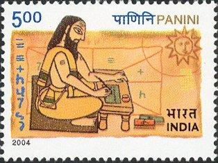

<!-- _class: title -->

𝕋v = v Reading Group

# Categorical types and AGI

## 1. Categories and Functors

Akshay Shanker7 August 2026

---

<!-- _class: quote -->

> "Applied category theory is information plumbing. It’s boring… but plumbers save more lives than doctors."

DisCoPy project, "Why?" &middot; <a href="https://discopy.org/">discopy.org</a>.

---

Part 1

# Introduction

---

Introduction &middot; purpose and method

## Objective

These sessions run over six to eight talks. Their objective is enough basic working fluency in **category theory** and **type theory** arguments to assess the usefulness of both languages for three subjects:

- applied high-dimensional dynamic programming and reinforcement learning;
- formal representation of models on the computer; and
- AI systems that read, compare, transform, or *verify* those representations.

<strong>Overarching question.</strong> Can categorical type theory formalize structures that are too <strong>complicated</strong>, or that remain <strong>implicit</strong>, in the notation of fields like analysis, calculus, and optimisation?

---

Introduction &middot; Category theory

## Category theory

- Category theory organizes objects and morphisms with specified domains and codomains.
- Category theory shifts the focus from properties of objects to relations between objects and to transformations of those relations.
- Standard results can be proved by simpler arguments that are general enough to be reused across fields.

---

Introduction &middot; Type theory

## Type theory

- Type theory is a formal system that classifies objects by their types.
- Types classify terms (expressions) and rule out invalid compositions among them.
- A **typing judgment** $\Gamma \vdash t : A$ asserts that, under the assumptions recorded in the **context** $\Gamma$ — a finite list of typed variables $x_1 : A_1, \ldots, x_n : A_n$ — the **term** $t$ has the **type** $A$. The context, the term, and the type are three different pieces of syntax; the judgment is the assertion relating them.

<strong>Categorical type theory.</strong> A type theory generates a classifying category, which records what can be composed.
A model is a structure-preserving functor from that category into a <strong>semantic</strong> category.

Jacobs (1999), pp. 4–7 and Chapter 2: typed contexts and terms generate a category (judgments Γ ⊢ t : A appear in Definition 2.1.1, p. 124); models are structure-preserving functors from its classifying category.

---

Introduction &middot; Motivation 

## Symbolic dynamic programming

The motivating research is a formal symbolic system that represents abstract dynamic programs and recursive decision processes.

- Its syntax is programmable.
- The system represents the abstract model and maps it to computational implementations.
- It does not represent computational procedures.
- Its semantics is denotational (what expressions mean) rather than operational (how a machine executes them).

A closely related project is a functional-programming system for dynamic programming in the style of Backus (1978).

  
declaretyped syntax signature + grammar

  
→

  
organiseclassifying category Cl(Σ)

  
→

  
interpretsemantics: mathematics or code

---

Introduction &middot; contents

## Contents

1. **Introduction.** Part 1 states the objective, introduces category theory and type theory, and presents the symbolic-dynamic-programming motivation.
2. **Categories and functors.** Part 2 develops Riehl §§1.1–1.3 and §1.6: categories and their examples, isomorphism, commutative diagrams and a diagram chase, duality with Exercise 1.2.vii, monomorphisms and epimorphisms, functors, and the first lemma.
3. **A dynamic-programming application.** Part 3 asks how the Bellman operator is elaborated from first-order typed syntax.

---

Introduction &middot; notation

## Notation

- Categories are sans-serif ($\mathsf{C}, \mathsf{D}$); objects are lower case ($x, y, c$); functors are upper case ($F, G, U$); natural transformations are Greek ($\alpha, \beta, \eta$). The collection of morphisms $x \to y$ is written $\mathsf{C}(x, y)$.
- $\alpha, \beta, \eta$ are reserved for natural transformations; the shock in the application section is written $\xi'$, never $\eta$.
- $\Gamma$ always denotes a typing context, as in the judgment $\Gamma \vdash t : A$; the feasibility correspondence of the application section is written $\mathcal{D}$, with value $\mathcal{D}(m)$ at the state $m$.
- $\operatorname{Cl}(\Sigma)$ denotes the classifying category of a signature $\Sigma$ (Jacobs 1999). In the application section, $\mathbb{R}^X$ denotes the bounded measurable real-valued functions on $X$, and $\mathbb{T} : \mathbb{R}^X \to \mathbb{R}^X$ is the Bellman operator.
- $\llbracket\cdot\rrbracket$ denotes the first-order denotation map of the application section; $\Upsilon$ denotes the full elaboration, which applies $\llbracket\cdot\rrbracket$ and then the operator lift; the elaboration of the operator declaration is written $\Upsilon(\texttt{op bellman}) = \mathbb{T}$.
- Scoped reuse, declared once: in the category-theory sections $f, g, h, k$ are generic morphisms (Riehl's convention); in the application section $g : X \times A \times Z \to X$ is the declared state transition. $P$ denotes a poset $(P, \leq)$.

---

Introduction &middot; preview

## Preview

The destination of these sessions is the notion of a natural transformation, which needs one prior notion. A **functor** $F : \mathsf{C} \to \mathsf{D}$ assigns to each object $c$ of $\mathsf{C}$ an object $Fc$ of $\mathsf{D}$ and to each morphism $f : c \to c'$ a morphism $Ff : Fc \to Fc'$, preserving identities and composition. For parallel functors $F, G : \mathsf{C} \to \mathsf{D}$, a **natural transformation** $\alpha : F \Rightarrow G$ has a **component** $\alpha_c : Fc \to Gc$ for every object $c$ of $\mathsf{C}$, and for every morphism $f : c \to c'$ it satisfies

$$\alpha_{c'} \circ Ff \;=\; Gf \circ \alpha_c.$$

The later sessions define each part in full.

Riehl (2016), Definition 1.3.1 (pp. 14–15) for functors; Definition 1.4.1 and the naturality equation (p. 25) for natural transformations.

---

Part 2

# Categories and functors

---

Category theory &middot; Riehl §1.1

## A category

**Definition 1.1.1.** A category consists of a collection of **objects** $X, Y, Z, \ldots$ and a collection of **morphisms** $f, g, h, \ldots$ such that each morphism has a specified domain and codomain ($f : X \to Y$), each object has an identity $\mathrm{id}_X : X \to X$, and each composable pair has a specified composite — $f : X \to Y$ and $g : Y \to Z$ yield $gf : X \to Z$ — subject to two axioms:

- **unitality**: $\mathrm{id}_Y f = f = f\, \mathrm{id}_X$ for every $f : X \to Y$;
- **associativity**: $h(gf) = (hg)f$ for every composable triple.

Definition 1.1.1 supplies no elements, no membership relation, and no underlying sets. The objects are recoverable from the identity morphisms (Remark 1.1.2), so of the two collections the **morphisms** take primacy. A category is an algebra of composition.

Riehl (2016), Definition 1.1.1 and Remark 1.1.2 (pp. 3–4).

---

Category theory &middot; Riehl §1.1

## Categories versus sets

In each of the examples listed in Example 1.1.3, the collection of objects is not a set (Remark 1.1.5).

**Notation.** For objects $x, y$, write $\mathsf{C}(x, y)$ for the collection of morphisms $x \to y$.

**Definitions 1.1.6–1.1.7.** A category is **small** if it has only a set's worth of arrows in total, and **locally small** if between any pair of objects there is only a set's worth of morphisms — that is, each $\mathsf{C}(x, y)$ is a set. Small implies locally small, because a subcollection of a set is a set. The converse fails.

A set is known through its elements and the membership relation. A category is known through its morphisms and their composition. Its notion of sameness is isomorphism (Definition 1.1.10), not equality.

Riehl (2016), Remark 1.1.5 (p. 6); Definitions 1.1.6–1.1.7, small and locally small (p. 7).

---

Category theory &middot; Riehl §1.1

## Morphisms need not be functions

### The morphisms are functions

- The objects of $\mathsf{Set}$ are sets, and its morphisms are functions.
- The objects of $\mathsf{Vect}_k$ are vector spaces over a field $k$, and its morphisms are linear maps.
- The objects of $\mathsf{Meas}$ are measurable spaces, and its morphisms are measurable functions.
- The objects of $\mathsf{Poset}$ are partially ordered sets, and its morphisms are order-preserving maps.

### The morphisms are not functions

- The objects of $\mathsf{Mat}_{\mathbb{R}}$ are positive integers, its morphisms $n \to m$ are the $m \times n$ matrices, and composition is matrix multiplication.
- The category $\mathsf{B}M$ has a single object. Its morphisms are the elements of a monoid $M$, a set carrying an associative multiplication with a unit, and composition is that multiplication.
- A preorder $(P, \leq)$ is a category with exactly one morphism $x \to y$ when $x \leq y$ and none otherwise. Transitivity supplies the composites, and reflexivity supplies the identities.

Riehl (2016), Example 1.1.3 (i), (v), (ix), (x) and Example 1.1.4 (i)–(iii), §1.1, pp. 4–5.

---

Category theory &middot; Riehl §1.1

## Isomorphism

**Definition 1.1.10.** A morphism $f : X \to Y$ is an **isomorphism** when there exists $g : Y \to X$ with $gf = \mathrm{id}_X$ and $fg = \mathrm{id}_Y$; the objects are then isomorphic, $X \cong Y$.

**Examples 1.1.11.**

- In $\mathsf{Set}$, the isomorphisms are the bijections.
- In $\mathsf{Top}$, the category whose objects are topological spaces and whose morphisms are continuous maps (Example 1.1.3(ii)), the isomorphisms are the homeomorphisms, a strictly stronger property than being bijective and continuous. The ambient category, not the underlying sets, decides what counts as the same.
- In a poset, the only isomorphisms are the identities, which is the categorical statement of antisymmetry.

Riehl (2016), Definition 1.1.10 and Example 1.1.11 (i), (iii), (v), §1.1, pp. 7–8; Top as Example 1.1.3(ii), p. 4.

---

<!-- _class: quote -->

> "A category provides a context in which to answer the question 'When is one thing the same as another thing?'"

Riehl (2016), <em>Category Theory in Context</em>, §1.1, p. 7.

---

Category theory &middot; Riehl §1.6

## Commutative diagrams

**Definition 1.6.4.** A **diagram** in a category $\mathsf{C}$ is a functor $F : \mathsf{J} \to \mathsf{C}$; the domain $\mathsf{J}$ is called the indexing category of the diagram.

A **quiver** is a directed graph that may contain loops and parallel arrows. The objects and morphisms of a category form one, and every finite directed path in it has a specified composite, well defined by the associativity axiom of Definition 1.1.1 (pp. 3–4). A diagram is displayed as a quiver of morphisms, and the display **commutes** when the parallel directed paths it presents with common source and target have equal composites. A commutative triangle asserts that the hypotenuse equals the composite of the legs (1.6.1).

Riehl (2016), §1.1: quivers, paths, and their composites, pp. 3–4; §1.6: commuting paths and the triangle (1.6.1), p. 39; Definition 1.6.4, p. 40.

---

Category theory &middot; Riehl §1.6

## Commutative diagrams

A square indexed by $2 \times 2$ (Example 1.6.6, Remark 1.6.7) commutes when $hf = kg$:

**Lemma 1.6.5.** Functors preserve commutative diagrams.

**Proof.** A diagram in $\mathsf{C}$ is a functor $F : \mathsf{J} \to \mathsf{C}$ (Definition 1.6.4); for any functor $G : \mathsf{C} \to \mathsf{D}$, the composite $GF : \mathsf{J} \to \mathsf{D}$ defines the image of the diagram in $\mathsf{D}$. $\blacksquare$

Riehl (2016), Example 1.6.6 and Remark 1.6.7 — the square with hf = kg, p. 41; Lemma 1.6.5 with proof, p. 41.

---

Category theory &middot; Riehl §1.6

## A diagram chase

**Lemma 1.6.11.** If, inside a composable path $f_n, \ldots, f_1$, a segment satisfies $f_k \cdots f_i = g_m \cdots g_1$, then $f_n \cdots f_1 = f_n \cdots f_{k+1}\, g_m \cdots g_1\, f_{i-1} \cdots f_1$.

**Proof.** Composition is well-defined: if two composites define the same arrow, then pre- and postcomposing each with the same sequences of arrows again gives the same arrow. $\blacksquare$

"This very simple result underlies most proofs by 'diagram chasing'." For a diagram depicted by a **simple acyclic quiver** — at most one edge between any two vertices, and no directed cycles — under the convention that the quiver represents a poset category, commutativity of the entire diagram follows from commutativity of its minimal subdiagrams; for the cube $2 \times 2 \times 2$, these are the six faces.

Riehl (2016), §1.6: Lemma 1.6.11 with proof, pp. 42–43; minimal subdiagrams and the cube, p. 43; the section's epigraph is Eilenberg–Steenrod on diagrams, p. 39.

---

Category theory &middot; Riehl §1.6

## Pasting squares

**Example (pasting, diagram 1.6.10).** Suppose the two inner squares commute, $hf = kg$ and $\ell j = mh$. Then the outer rectangle commutes, $\ell(jf) = (mk)g$:

**Chase.** $\ell j f = (mh)f$ — substitute $\ell j = mh$ (Lemma 1.6.11); $= m(hf)$ — associativity (Definition 1.1.1); $= m(kg)$ — substitute $hf = kg$ (Lemma 1.6.11); $= (mk)g$ — associativity. $\blacksquare$

Riehl (2016), §1.6: the two-squares-make-a-rectangle diagram (1.6.10), p. 42.

---

Category theory &middot; Riehl §1.2

## Duality through the opposite category

**Definition 1.2.1.** The opposite category $\mathsf{C}^{\mathrm{op}}$ has the same objects as $\mathsf{C}$ and a morphism $f^{\mathrm{op}} : y \to x$ for each $f : x \to y$ of $\mathsf{C}$, with composites $f^{\mathrm{op}} g^{\mathrm{op}} = (gf)^{\mathrm{op}}$.

**The duality principle.** A theorem of the form "for all categories $\mathsf{C}$, a given statement holds" applies in particular to every opposite category $\mathsf{C}^{\mathrm{op}}$. Re-expressing that conclusion in terms of the data of $\mathsf{C}$ reverses the direction of every morphism and the order of every composite. The re-expressed statement is the dual statement, and the re-expressed proof is the dual proof — "a two-for-one deal: any proof in category theory simultaneously proves two theorems" (p. 10).

Riehl (2016), Definition 1.2.1 (p. 9); the duality principle and the two-for-one description (p. 10).

---

Category theory &middot; Riehl §1.2

## Duality through the opposite category

**Lemma 1.2.3.** For $f : x \to y$ the following are equivalent: (i) $f$ is an isomorphism; (ii) postcomposition $f_{*} : \mathsf{C}(c, x) \to \mathsf{C}(c, y)$, $h \mapsto f h$, is a bijection for every $c$; (iii) precomposition $f^{*} : \mathsf{C}(y, c) \to \mathsf{C}(x, c)$, $k \mapsto k f$, is a bijection for every $c$.

Riehl proves (i) ⇔ (ii) directly and obtains (i) ⇔ (iii) by re-reading (i) ⇔ (ii) in $\mathsf{C}^{\mathrm{op}}$. The next two slides work that dualization in full. It is the one worked dualization of these sessions, cited thereafter.

Riehl (2016), Lemma 1.2.3 and Remark 1.2.4 (p. 11) — isomorphisms are characterized representably.

---

Category theory &middot; Riehl §1.2

## Applying duality to Lemma 1.2.3

Fix $f : x \to y$ in $\mathsf{C}$; by Definition 1.2.1 it corresponds to $f^{\mathrm{op}} : y \to x$ in $\mathsf{C}^{\mathrm{op}}$. The equivalence (i) ⇔ (ii) of Lemma 1.2.3 is proved for all categories, so it holds in $\mathsf{C}^{\mathrm{op}}$. Three translations, each an instance of Definition 1.2.1, convert that statement into (i) ⇔ (iii) for $\mathsf{C}$.

First, $\mathsf{C}^{\mathrm{op}}(c, y) = \mathsf{C}(y, c)$ for every object $c$: a morphism $c \to y$ of $\mathsf{C}^{\mathrm{op}}$ is $h^{\mathrm{op}}$ for exactly one $h : y \to c$ of $\mathsf{C}$.

Second, postcomposition by $f^{\mathrm{op}}$ in $\mathsf{C}^{\mathrm{op}}$ is precomposition by $f$ in $\mathsf{C}$: for $h : y \to c$, the composition rule of Definition 1.2.1 gives $f^{\mathrm{op}} h^{\mathrm{op}} = (hf)^{\mathrm{op}} = (f^{*}h)^{\mathrm{op}}$, so under the first translation $(f^{\mathrm{op}})_{*} : \mathsf{C}^{\mathrm{op}}(c, y) \to \mathsf{C}^{\mathrm{op}}(c, x)$ is the map $f^{*} : \mathsf{C}(y, c) \to \mathsf{C}(x, c)$.

Riehl (2016), proof of Lemma 1.2.3, pp. 11–12: the displays (1.2.5)–(1.2.6).

---

Category theory &middot; Riehl §1.2

## Applying duality to Lemma 1.2.3

Third, $f^{\mathrm{op}}$ is an isomorphism in $\mathsf{C}^{\mathrm{op}}$ if and only if $f$ is an isomorphism in $\mathsf{C}$: if $gf = \mathrm{id}_x$ and $fg = \mathrm{id}_y$ (Definition 1.1.10), the composition rule gives $f^{\mathrm{op}} g^{\mathrm{op}} = (gf)^{\mathrm{op}} = \mathrm{id}_x$ and $g^{\mathrm{op}} f^{\mathrm{op}} = (fg)^{\mathrm{op}} = \mathrm{id}_y$, so $g^{\mathrm{op}}$ inverts $f^{\mathrm{op}}$; the converse follows by the same argument in $\mathsf{C}^{\mathrm{op}}$, whose opposite is $\mathsf{C}$.

Substituting the three translations into "(i) ⇔ (ii) for $f^{\mathrm{op}}$ in $\mathsf{C}^{\mathrm{op}}$" yields: $f$ is an isomorphism in $\mathsf{C}$ if and only if $f^{*} : \mathsf{C}(y, c) \to \mathsf{C}(x, c)$ is a bijection for every object $c$. That is the equivalence (i) ⇔ (iii) in $\mathsf{C}$.

Exercise 1.2.vii, worked next, shows that the supremum–infimum duality of analysis is exactly categorical duality.

Riehl (2016), proof of Lemma 1.2.3, pp. 11–12: "the notion of isomorphism, as defined in 1.1.10, is self-dual."

---

Category theory &middot; Riehl §1.2, Exercise 1.2.vii

## Exercise 1.2.vii

**Exercise 1.2.vii** (Riehl, verbatim). "Regarding a poset $(P, \leq)$ as a category, define the supremum of a subcollection of objects $A \in P$ in such a way that the dual statement defines the infimum. Prove that the supremum of a subset of objects is unique, whenever it exists, in such a way that the dual proof demonstrates the uniqueness of the infimum."

**Notation.** $(P, \leq)$ is the category with a unique morphism $x \to y$ exactly when $x \leq y$ (Example 1.1.4(iii)), and the subcollection is $A \subseteq P$.

Riehl (2016), Exercise 1.2.vii (pp. 13–14).

---

Category theory &middot; Riehl §1.2, Exercise 1.2.vii

## Supremum

**Definition.** An object $s$ is a **supremum** of $A$ when:

- (i) for every $a \in A$ there is a morphism $a \to s$ — that is, $s$ is an upper bound of $A$;
- (ii) for every $u$ admitting a morphism $a \to u$ from every $a \in A$, there is a morphism $s \to u$ — that is, $s$ maps into every upper bound.

**Dualization.** By Definition 1.2.1, a morphism $x \to y$ in $P^{\mathrm{op}}$ is a morphism $y \to x$ in $P$. Since $P$ has a morphism $y \to x$ exactly when $y \leq x$ (Example 1.1.4(iii)), the order of $P^{\mathrm{op}}$ is the reversed order: $x \leq y$ in $P^{\mathrm{op}}$ means $y \leq x$ in $P$.

Conditions (i)–(ii) are a universal property, the shape Chapter 2 studies in general. In the language of Chapter 3, the supremum is the colimit of the collection A.

---

Category theory &middot; Riehl §1.2, Exercise 1.2.vii

## Supremum

Now read the two conditions for an object $i$ of $P^{\mathrm{op}}$.

Condition (i) asks for a morphism $a \to i$ in $P^{\mathrm{op}}$ for every $a \in A$; by the translation just stated, this says $i \leq a$ for every $a \in A$, so $i$ is a lower bound of $A$ in $P$.

Condition (ii) asks for a morphism $i \to u$ in $P^{\mathrm{op}}$, that is, $u \leq i$ in $P$, for every $u$ that admits a morphism $a \to u$ in $P^{\mathrm{op}}$ from every $a \in A$, that is, for every lower bound $u$ of $A$ in $P$.

Together the two conditions say: $i$ is a lower bound of $A$, and every lower bound $u$ satisfies $u \leq i$. By the definition of the infimum as the greatest lower bound, $i = \inf A$.

The supremum in $P^{\mathrm{op}}$ is the **infimum** in $P$, as the exercise requires.

---

Category theory &middot; Riehl §1.2, Exercise 1.2.vii

## Uniqueness of the supremum

**Proposition.** If $s$ and $s'$ are both suprema of $A \subseteq P$, then $s = s'$.

**Proof.** Assume $s$ and $s'$ each satisfy conditions (i) and (ii) of the definition of the supremum.

**Step 1.** By condition (i), applied to $s$ and to $s'$ in turn, each of $s$ and $s'$ is an upper bound of $A$.

**Step 2.** Condition (ii) for $s'$, applied to the upper bound $s$ produced by Step 1, yields a morphism $s' \to s$.

**Step 3.** Condition (ii) for $s$, applied to the upper bound $s'$ produced by Step 1, yields a morphism $s \to s'$.

**Step 4.** By Definition 1.1.1 the composites $s \to s' \to s$ and $s' \to s \to s'$ exist. A preorder, and in particular a poset, has at most one morphism between any two objects (Example 1.1.4(iii)), and $\mathrm{id}_s \in P(s, s)$ by Definition 1.1.1; hence the composite $s \to s' \to s$ equals $\mathrm{id}_s$, and likewise $s' \to s \to s'$ equals $\mathrm{id}_{s'}$. By Definition 1.1.10 the morphisms of Steps 2 and 3 are therefore mutually inverse isomorphisms, so $s \cong s'$.

**Step 5.** In a poset the only isomorphisms are the identities, which is the categorical statement of antisymmetry (Example 1.1.11(v)); the isomorphism of Step 4 is thus an identity, and $s = s'$. $\blacksquare$

Riehl (2016), Exercise 1.2.vii (pp. 13–14); Example 1.1.11(v), p. 8, for the isomorphisms of a poset.

---

Category theory &middot; Riehl §1.2, Exercise 1.2.vii

## Uniqueness by duality

**Duality.** Reading Steps 1–5 in $P^{\mathrm{op}}$ proves, word for word, that the infimum is unique whenever it exists. No second argument is written.

Steps 1–4 use conditions (i)–(ii), the category axioms, and the fact that a preorder has at most one morphism between any two objects. They do not use antisymmetry. Hence any two suprema of $A$ in a preorder are isomorphic. In a poset, antisymmetry enters at Step 5 and implies that the two suprema are equal.

The dual reading runs in the opposite category of Definition 1.2.1. Example 1.1.4(iii) and Example 1.1.11(v) are self-dual, which is why the dual proof needs no adjustment.

---

Category theory &middot; Riehl §1.2

## Monomorphisms and epimorphisms

Definitions dualize as theorems do.

**Definition 1.2.7.** A morphism $f : x \to y$ in a category $\mathsf{C}$ is a **monomorphism** if for every object $w$ and every parallel pair $h, k : w \to x$, $fh = fk$ implies $h = k$; and an **epimorphism** if for every object $z$ and every parallel pair $h, k : y \to z$, $hf = kf$ implies $h = k$.

**Duality.** $f : x \to y$ is a monomorphism in $\mathsf{C}$ if and only if $f^{\mathrm{op}} : y \to x$ is an epimorphism in $\mathsf{C}^{\mathrm{op}}$; and $f$ is an epimorphism in $\mathsf{C}$ if and only if $f^{\mathrm{op}}$ is a monomorphism in $\mathsf{C}^{\mathrm{op}}$. To verify the first claim: a parallel pair $h, k : w \to x$ in $\mathsf{C}$ is a parallel pair $h^{\mathrm{op}}, k^{\mathrm{op}} : x \to w$ in $\mathsf{C}^{\mathrm{op}}$, and the composition rule of Definition 1.2.1 gives $(fh)^{\mathrm{op}} = h^{\mathrm{op}} f^{\mathrm{op}}$ and $(fk)^{\mathrm{op}} = k^{\mathrm{op}} f^{\mathrm{op}}$; so the left-cancellation property "$fh = fk$ implies $h = k$" for $f$ in $\mathsf{C}$ is the right-cancellation property "$h^{\mathrm{op}} f^{\mathrm{op}} = k^{\mathrm{op}} f^{\mathrm{op}}$ implies $h^{\mathrm{op}} = k^{\mathrm{op}}$" for $f^{\mathrm{op}}$ in $\mathsf{C}^{\mathrm{op}}$, which is the epimorphism condition. The second claim follows by applying the first in $\mathsf{C}^{\mathrm{op}}$.

Riehl (2016), Definition 1.2.7 with the parallel-pair quantifiers and the duality clause following it (p. 12); Definition 1.2.1 (pp. 9–10).

---

Category theory &middot; Riehl §1.2

## Monomorphisms and epimorphisms in Set and Ring

**Example 1.2.8.** In $\mathsf{Set}$, the monomorphisms are precisely the injections and the epimorphisms are precisely the surjections.

**The axiom of choice.** Let $f : X \to Y$ be a surjection. A **section** of $f$ is a function $s : Y \to X$ such that $f \circ s = \mathrm{id}_Y$ (Example 1.2.9: a right inverse; an epimorphism admitting a section is **split**). The assertion that every surjection in $\mathsf{Set}$ admits a section is equivalent to the axiom of choice. Because the epimorphisms in $\mathsf{Set}$ are precisely the surjections (Example 1.2.8), this is Remark 1.2.10's formulation: the axiom of choice asserts that every epimorphism in the category of sets is a split epimorphism.

**Example 1.2.11.** In $\mathsf{Ring}$, the inclusion $\mathbb{Z} \hookrightarrow \mathbb{Q}$ is a monomorphism **and** an epimorphism yet not an isomorphism: there are no ring homomorphisms $\mathbb{Q} \to \mathbb{Z}$. That the inclusion is epic is part of Exercise 1.2.iv; the argument is that a ring homomorphism out of $\mathbb{Q}$ is determined by its values on $\mathbb{Z}$.

Categorical surjectivity is right-cancellability, and right-cancellability can hold without surjectivity. Which morphisms are epimorphisms depends on the ambient category.

Riehl (2016), Examples 1.2.8 and 1.2.9 (p. 12), Remark 1.2.10 and Example 1.2.11 (p. 13), Exercise 1.2.iv (p. 13), §1.2.

---

Category theory &middot; Riehl §1.3

## Functors

**Definition 1.3.1.** A functor $F : \mathsf{C} \to \mathsf{D}$ assigns an object $Fc$ to each object $c$ and a morphism $Ff : Fc \to Fc'$ to each $f : c \to c'$, preserving the structure: $Fg \cdot Ff = F(gf)$ and $F(\mathrm{id}_c) = \mathrm{id}_{Fc}$.

**Examples 1.3.2.**

- The forgetful functor $U : \mathsf{Vect}_k \to \mathsf{Set}$ sends a vector space to its underlying set. The free functor $F : \mathsf{Set} \to \mathsf{Group}$ sends a set to the free group on it, whose elements are the reduced words in the set's elements and their formal inverses.
- The fundamental group $\pi_1 : \mathsf{Top}_* \to \mathsf{Group}$, where $\mathsf{Top}_*$ is the category whose objects are pointed topological spaces — spaces with a chosen basepoint — and whose morphisms are basepoint-preserving continuous maps (Example 1.1.3(iii)). It assigns to a pointed space the group of loops at the basepoint taken up to continuous deformation, and it is the archetype of an invariant.

Riehl (2016), Definition 1.3.1, Example 1.3.2 (ii), (vi), (ix), §1.3, pp. 14–16; Top⋆ as Example 1.1.3(iii), p. 4.

---

Category theory &middot; Riehl §1.3

## Functors

**Examples 1.3.2.**

- The chain rule $D(g \circ f)_a = Dg_{f(a)} \cdot Df_a$ states exactly that $f \mapsto Df$ is functorial on pointed Euclidean spaces. This is the tenth part of Riehl's Example 1.3.2, where the chain rule is expressed as functoriality of the derivative (pp. 15–16).
- A **contravariant** functor is a functor $\mathsf{C}^{\mathrm{op}} \to \mathsf{D}$ (Definition 1.3.5). The closing application slides use one such functor, $\mathbb{R}^{(-)}$, which reverses the direction of the state transition.

Riehl (2016), Definition 1.3.5, Example 1.3.2 (x), §1.3, pp. 15–18.

---

Category theory &middot; Riehl §1.3

## Represented functors

> "…every sufficiently good analogy is yearning to become a functor." — John Baez, epigraph to §1.3

**Definition 1.3.11.** For locally small $\mathsf{C}$ and $c \in \mathsf{C}$: the covariant represented functor $\mathsf{C}(c, -) : \mathsf{C} \to \mathsf{Set}$ sends $x \mapsto \mathsf{C}(c, x)$ and $f \mapsto f_{*}$; the contravariant $\mathsf{C}(-, c) : \mathsf{C}^{\mathrm{op}} \to \mathsf{Set}$ sends $f \mapsto f^{*}$.

Postcomposition is always covariant, and precomposition is always contravariant. The functor $\mathbb{R}^{(-)}$ of the closing application slides is the measurable-space analogue of the represented functor $\mathsf{Set}(-, \mathbb{R})$: it sends a measurable space $X$ to the bounded measurable functions on $X$ and a map to precomposition, exactly the pattern of Definition 1.3.11.

Applying "functors preserve isomorphisms" to the represented functors re-proves (i) ⇒ (ii) and (i) ⇒ (iii) of Lemma 1.2.3.

Riehl (2016), §1.3: Definition 1.3.11 and the covariance remark (p. 20); Baez epigraph (p. 14).

---

Category theory &middot; Riehl §1.3

## Additional properties of functors

- **Bifunctoriality** (Definitions 1.3.12–1.3.13). The product $\mathsf{C} \times \mathsf{D}$ is formed componentwise, and the two represented functors combine into one **bifunctor** — a functor of two variables — $\mathsf{C}(-, -) : \mathsf{C}^{\mathrm{op}} \times \mathsf{C} \to \mathsf{Set}$, acting on morphisms by $g \mapsto h g f$.
- **Preservation.** Split monomorphisms and epimorphisms — those admitting a one-sided inverse — are preserved, because a one-sided inverse is an equation between composites and functors preserve such equations. General monomorphisms and epimorphisms need not be preserved.
- **$\mathsf{Cat}$.** Small categories and functors form a category $\mathsf{Cat}$, which is locally small but not small. The size distinctions of §1.1 return.

Riehl (2016), §1.3: Definitions 1.3.12–1.3.13 (p. 21); preservation of split monomorphisms and epimorphisms (p. 20); Cat (p. 21).

---

Category theory &middot; Riehl §1.3

## The first lemma of category theory

**Lemma 1.3.8.** *Functors preserve isomorphisms.*

**Proof.** The proof uses Definition 1.1.10 (isomorphism and inverse) and the two functoriality axioms of Definition 1.3.1.

Let $F : \mathsf{C} \to \mathsf{D}$ be a functor and $f : x \to y$ an isomorphism with inverse $g : y \to x$ (Definition 1.1.10). Then

$$Fg \cdot Ff \;=\; F(gf) \;=\; F(\mathrm{id}_x) \;=\; \mathrm{id}_{Fx},$$

the first equality by the composition axiom of Definition 1.3.1, the second because $gf = \mathrm{id}_x$ (Definition 1.1.10), the third by the identity axiom of Definition 1.3.1. So $Fg$ is a left inverse of $Ff$; exchanging the roles of $f$ and $g$ in the same three equalities gives $Ff \cdot Fg = \mathrm{id}_{Fy}$, so the inverse is two-sided and $Ff$ is an isomorphism (Definition 1.1.10). $\blacksquare$

Riehl (2016), Lemma 1.3.8 with proof, §1.3, p. 19. The lemma appears immediately after functors are first defined in Eilenberg–Mac Lane (1942) — "arguably the first lemma in category theory" (Riehl).

---

Category theory &middot; Riehl §1.3

## Consequences of the first lemma

- If $\pi_1(X) \not\cong \pi_1(Y)$, then $X \not\cong Y$. Any functorial assignment separates objects that it sends to non-isomorphic values.
- A functor $\mathsf{B}G \to \mathsf{C}$, where $\mathsf{B}G$ is the one-object category of a group $G$ (the construction $\mathsf{B}M$ of the slide "Morphisms need not be functions", applied to a group), is exactly an action of $G$ (Example 1.3.9). Each $g \in G$ is an isomorphism in $\mathsf{B}G$, so it must act by automorphisms (isomorphisms of an object with itself), with $(g^{-1})_* = (g_*)^{-1}$, and no separate proof is required (Corollary 1.3.10).
- The introduction stated that a model of a type theory is a structure-preserving functor from its classifying category. The lemma is the first instance of the pattern these sessions develop, in which a property established for the syntax transfers to every interpretation. The closing application slides work one example in full.

Riehl (2016), Example 1.3.9 (p. 19) and Corollary 1.3.10 (p. 20), §1.3.

---

Category theory &middot; Riehl §1.3

## The Brouwer fixed-point theorem

**Theorem 1.3.3** (Brouwer fixed-point theorem). Any continuous endomorphism of a 2-dimensional disk $D^2$ has a fixed point.

**The functorial argument.** If a fixed-point-free continuous map $f : D^2 \to D^2$ existed, the point where the ray from $f(x)$ through $x$ meets the boundary circle would define a retraction $r : D^2 \to S^1$ of the boundary inclusion $i : S^1 \hookrightarrow D^2$, that is, $ri = \mathrm{id}_{S^1}$; applying $\pi_1$ (with a basepoint chosen on $S^1$) and the two functoriality axioms of Definition 1.3.1 would give $\pi_1(r)\,\pi_1(i) = \pi_1(ri) = \mathrm{id}_{\pi_1(S^1)}$, making the identity of $\pi_1(S^1) \cong \mathbb{Z}$ factor through the trivial group $\pi_1(D^2) \cong 0$, which is impossible: a homomorphism that factors through the trivial group sends the generator $1 \in \mathbb{Z}$ to $0 \neq 1$.

**Inputs not proved here.** The computations $\pi_1(S^1) \cong \mathbb{Z}$ and $\pi_1(D^2) \cong 0$ are inputs to the argument. Riehl obtains them from covering-space theory, which these sessions do not develop.

Riehl (2016), Theorem 1.3.3 with proof, §1.3, pp. 16–17; π₁ : Top⋆ → Group is Example 1.3.2(vi), p. 15.

---

Part 3

# A dynamic-programming application

---

Application &middot; grammar

## Context-free grammar

<strong>Pāṇini</strong>, c. 4th century BCE the <em>Aṣṭādhyāyī</em>

<strong>John Backus</strong>, 1924–2007 creator of Fortran; proponent of functional programming

A context-free grammar is a finite set of rewrite rules applied <em>recursively</em> to generate every well-formed expression of a language, each rule applying independently of surrounding context. Programming languages are parsed using a grammar (with some context) and then interpreted and compiled.

Ingerman (<em>CACM</em> 10(3), 1967) proposed "Pāṇini–Backus form" as the fairer name &middot; Penn &amp; Kiparsky, "On Pāṇini and the Generative Capacity of Contextualized Replacement Systems," <em>COLING 2012</em>, 943–950 — <a href="https://aclanthology.org/C12-2092/">aclanthology.org/C12-2092</a> &middot; images: Wikimedia Commons

---

Application &middot; the buffer-stock example

## First-order syntax for the Bellman operator

$$v(m) \;=\; \max_{c \,\in\, \mathcal{D}(m)} \Big\{\, u(c) \;+\; \beta\, \mathbb{E}_{\xi'}\, v\big(R(m-c)+\xi'\big) \Big\} \qquad\text{i.e.}\qquad v = \mathbb{T}\,v$$

- $X$ is the state space, and $m \in X$ is current resources. $A$ is the choice space, $\mathcal{D}(m) \subseteq A$ is the feasible set at $m$, and $c \in \mathcal{D}(m)$ is current consumption.
- $Z$ is the shock space, and $\xi' \in Z$ is the next-period income shock, drawn from a fixed probability distribution on $Z$; $\mathbb{E}_{\xi'}$ denotes expectation under that law.

- $R > 0$ is the gross return factor, and $g : X \times A \times Z \to X$, defined by $g(m, c, \xi') = R(m-c) + \xi'$, is the transition.
- $u : A \to \mathbb{R}$ is one-period utility, $\beta \in (0,1)$ is the discount factor, and $v$ is a candidate continuation-value function in $\mathbb{R}^X$, the bounded measurable functions on $X$.

---

Application &middot; the buffer-stock example

## Syntax for the Bellman operator

Formally we will say something like "$v\in \mathcal{B}_{\varphi}(X)$, the space of bounded measurable functions on $X$ for some $\varphi$" and let $\mathbb{T}$ be defined by the evaluation:

$$v(m) \;=\; \max_{c \,\in\, \mathcal{D}(m)} \Big\{\, u(c) \;+\; \beta\, \mathbb{E}_{\xi'}\, v\big(R(m-c)+\xi'\big) \Big\} \qquad\forall m \in X$$

... how do I explain this to an AI such that it recognizes it deterministically? (verification)

 
 

We want a symbolic representation of the Bellman operator. 

---

Application &middot; the buffer-stock example

## First-order syntax for the Bellman operator

Call a map **higher-order** when it takes a function as an input or returns one as an output, and call syntax **first-order** when functions are not themselves inputs or outputs of the parsed expressions.

A parser produces an **abstract syntax tree** (AST): one syntax tree built from the grammar's constructors. 

- an AST *cannot* represent bound variables
- higher order requires some context

How can first-order typed syntax elaborate the transition and payoff expressions into the higher-order map $\mathbb{T} : v \mapsto \mathbb{T}v$?

Goguen, Thatcher, Wagner, and Wright (1977), Proposition 2.1: the well-formed expressions (trees) of each sort form the carriers of the term algebra.

---

Application &middot; binding

## An AST cannot represent bound variables

Normalized symbolic source

<code>Val[>]</code> is continuation; <code>Val[~]</code> is decision.

<pre class="bellman-source"><code>op bellman(v : Val[>]) : Val[~] {
  v(m) =
    max_{c ∈ D(m)} {
      u(c) + β E_{ξ′}[
        v(g(m, c, ξ′))
      ]
    }
}</code></pre>

Higher-order abstract syntax: Pfenning–Elliott (1988); abstract syntax graphs for DSLs: Oliveira–Löh (2013); initial semantics with binding: Fiore–Plotkin–Turi (1999), Lamiaux–Ahrens (2024).

---

Application &middot; binding

## An AST cannot represent bound variables

- **Bound occurrences** share a colour with their binders: $c$ with $\max_c$ and $\xi'$ with $\mathbb{E}_{\xi'}$. The typing context assigns a type to the free variable $m$.
- **The abstract syntax tree** contains no edge from a binder to its occurrences. Repeated names encode that association; drawing it explicitly turns the tree into a graph.
- **Raw tree equality** distinguishes $\max_c u(c)$ from $\max_d u(d)$, although the two terms denote the same function. Higher-order abstract syntax represents binding so that a change of bound name is irrelevant.
- **Concrete syntax, the tree, and the typing context** perform distinct tasks. Concrete context-free syntax determines which strings parse, the tree removes parenthesisation and precedence artifacts, and the typing context assigns types to free variables; none of these structures alone records binding.

In practice, too, well-formedness is stated outside the grammar: Stan Development Team (2025), <em>Stan Reference Manual</em>, version 2.39, ch. 11, p. 152, gives BNF "plus extra-grammatical constraints on function typing".

---

Application &middot; elaboration

## Elaboration of the Bellman operator

- **The parser** produces an $\texttt{op bellman}$ node containing the first-order equations. The context types the leaves, and the node has signature <code>Val[>] → Val[~]</code>.
- **The denotation map** $\llbracket\cdot\rrbracket$ sends the parsed transition, reward, and feasibility expressions to $g$, $u$, and $m \mapsto \mathcal{D}(m)$.
- **The term-algebra property** determines this map uniquely: $\llbracket\cdot\rrbracket$ is the unique homomorphism from syntax trees to the algebra of declared spaces and maps.

Term algebras and initial-algebra semantics: Goguen–Thatcher–Wagner–Wright (1977).

---

Application &middot; elaboration

## The value-function functor

For well-definedness, $g$ must be measurable. Expectation and maximization must preserve the chosen function space, and the displayed maximum must be attained; these conditions are not proved here.

---

Closing &middot; the session sequence

## Topics

1. Categories and functors
2. Natural transformations
3. Universal properties and representable functors
4. The Yoneda lemma
5. Limits and colimits
6. Type theory: terms, types, judgments, and contexts
7. Categorical semantics: from typed syntax to models
8. Applications
   - dynamic programming, MDPs, and reinforcement learning
   - precise model descriptions for AI

---

Closing &middot; resources

## Further examples

- The [Category Theory for AGI, Spring 2026 course page](https://people.cs.umass.edu/~mahadeva/categorical-agi.html) is Sridhar Mahadevan's seminar at the University of Massachusetts Amherst.
- [Lecture 2: Functors](https://people.cs.umass.edu/~mahadeva/papers/lecture2.pdf) contains the example in which the objects are Markov decision processes, the arrows are MDP homomorphisms, and reinforcement-learning algorithms are presented as functors to value functions.
- [Categories for AGI](https://people.cs.umass.edu/~mahadeva/papers/catagi.pdf) is a longer treatment of the MDP and reinforcement-learning example.
- [Universal Decisions with Kan Extensions](https://people.cs.umass.edu/~mahadeva/papers/udm.pdf) is a more advanced decision-theory example.

---

Closing &middot; references

## References

- Backus, John (1978). "Can Programming Be Liberated from the von Neumann Style? A Functional Style and Its Algebra of Programs." ACM Turing Award lecture. *Communications of the ACM* 21(8), 613–641.
- Baez, John (2006). "Quantum Quandaries: A Category-Theoretic Perspective." Cited as the source of the epigraph to Riehl §1.3.
- DisCoPy project. "Why?" [discopy.org](https://discopy.org/), accessed 7 August 2026.
- Eilenberg, Samuel, and Saunders Mac Lane (1942). "Natural isomorphisms in group theory." *Proceedings of the National Academy of Sciences USA* 28, 537–543.
- Eilenberg, Samuel, and Norman Steenrod (1952). *Foundations of Algebraic Topology*. Cited as the source of the epigraph to Riehl §1.6.

---

Closing &middot; references

## References

- Fiore, Marcelo P., Gordon D. Plotkin, and Daniele Turi (1999). "Abstract Syntax and Variable Binding." *Proceedings of the Fourteenth Annual IEEE Symposium on Logic in Computer Science*, 193–202. DOI 10.1109/LICS.1999.782615.
- Goguen, J. A., J. W. Thatcher, E. G. Wagner, and J. B. Wright (1977). "Initial Algebra Semantics and Continuous Algebras." *Journal of the ACM* 24(1), 68–95.
- Ingerman, Peter Zilahy (1967). "'Pāṇini-Backus Form' Suggested." *Communications of the ACM* 10(3), 137. DOI 10.1145/363162.363165.
- Jacobs, Bart (1999). *Categorical Logic and Type Theory*. Studies in Logic and the Foundations of Mathematics 141. Amsterdam: Elsevier (North-Holland). ISBN 0-444-50170-3.
- Lamiaux, Thomas, and Benedikt Ahrens (2024). "An Introduction to Different Approaches to Initial Semantics." arXiv:2401.09366 [cs.LO].

---

Closing &middot; references

## References

- Mahadevan, Sridhar. *Category Theory for AGI*, Spring 2026 course page, University of Massachusetts Amherst. [people.cs.umass.edu/~mahadeva/categorical-agi.html](https://people.cs.umass.edu/~mahadeva/categorical-agi.html), accessed 7 August 2026.
- Mahadevan, Sridhar. "Lecture 2: Functors." [people.cs.umass.edu/~mahadeva/papers/lecture2.pdf](https://people.cs.umass.edu/~mahadeva/papers/lecture2.pdf), accessed 7 August 2026.
- Mahadevan, Sridhar. *Categories for AGI*. [people.cs.umass.edu/~mahadeva/papers/catagi.pdf](https://people.cs.umass.edu/~mahadeva/papers/catagi.pdf), accessed 7 August 2026.
- Mahadevan, Sridhar. *Universal Decisions with Kan Extensions*. [people.cs.umass.edu/~mahadeva/papers/udm.pdf](https://people.cs.umass.edu/~mahadeva/papers/udm.pdf), accessed 7 August 2026.
- Oliveira, Bruno C. d. S., and Andres Löh (2013). "Abstract Syntax Graphs for Domain Specific Languages." *Proceedings of PEPM '13*, 87–96. DOI 10.1145/2426890.2426909.

---

Closing &middot; references

## References

- Penn, Gerald, and Paul Kiparsky (2012). "On Pāṇini and the Generative Capacity of Contextualized Replacement Systems." *Proceedings of COLING 2012: Posters*, 943–950, Mumbai. [aclanthology.org/C12-2092](https://aclanthology.org/C12-2092/).
- Pfenning, Frank, and Conal Elliott (1988). "Higher-Order Abstract Syntax." *Proceedings of PLDI '88*, 199–208. DOI 10.1145/53990.54010.
- Riehl, Emily (2016). *Category Theory in Context*. Dover Publications. Author's free PDF: [emilyriehl.github.io/files/context.pdf](https://emilyriehl.github.io/files/context.pdf).
- Stan Development Team (2025). *Stan Reference Manual*, version 2.39.
