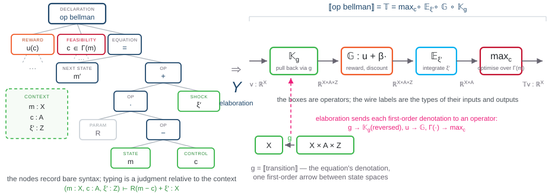

Motivation &middot; start from the model

## The model is higher-order; a parse tree is first-order

$$v(m) \;=\; \max_{c \,\in\, \Gamma(m)} \Big\{\, u(c) \;+\; \beta\, \mathbb{E}_{\xi'}\, v\big(R(m-c)+\xi'\big) \Big\} \qquad\text{i.e.}\qquad v = \mathbb{T}\,v$$

The equation quantifies over a **function**: $v$ ranges over $\mathbb{R}^X$, and $\mathbb{T}$ maps functions to functions. A parser sees only first-order expressions between variables. Three reasons no AST node can be $\mathbb{T}$ — and the repair:

1

No sort for function spaces

An AST is the term algebra of a <strong>first-order</strong> signature (ADJ 1977): its sorts are scalar expressions. 𝕋 : ℝ^X → ℝ^X lives between spaces the grammar cannot even name.

2

Binding is not tree shape

max_c and 𝔼_ξ′ <strong>bind</strong> c and ξ′; scope and α-equivalence are imposed on the tree by convention, not carried by it — the gap higher-order abstract syntax was invented to close.

3

𝕋 is named, never parsed

A declaration node — op bellman — can list the equations, but that node is a container of first-order syntax. The map between function spaces is the block's <strong>denotation</strong>: elaborated under a typed semantic context, not parsed.

4

The repair

Parse only <strong>first-order data</strong> (g, u, β) with types, then <strong>elaborate</strong>: Υ builds the higher-order operator graph. Next slide, step by step.

The CEF interoperability talk v2.4 states the point: a PBF/BNF tree has nodes for "expressions between variables" but "no node for an operator like 𝕋" — it must be "elaborated under a typed semantic context, not parsed"; the economist writes only first-order equations, and the lift induces the function-analytic objects. AST = initial algebra of a first-order signature: Goguen–Thatcher–Wagner–Wright (1977). Binding beyond first-order trees: Pfenning–Elliott (1988), Fiore–Plotkin–Turi (1999).

---

Motivation &middot; elaboration, step by step

## From the typed AST to the operator graph

<strong>Step by step.</strong> ① Parse the declaration: an op bellman node lists first-order equations, and the typed leaves declare the context. ② ⟦·⟧ sends each equation to its first-order denotation — the arrow g, the reward u, the feasibility Γ — a fold, the unique homomorphism out of the term algebra (ADJ 1977). ③ The functor ℝ^(−) lifts each into its operator box, reversing g's direction: backward induction, categorically. ④ Composition assembles ⟦op bellman⟧ = 𝕋 — the denotation of the declaration is the higher-order object that was never parsed.

Buffer stock (CEF interoperability talk v2.4): 𝕋v(m) = max_c { u(c) + β 𝔼_ξ′ v(R(m−c) + ξ′) }, g(m, c, ξ′) = R(m−c) + ξ′; R enters by calibration, not through the context. Operator names follow the Bellman-calculus decomposition B_≻ = 𝔼_η ∘ 𝔾_≻ ∘ 𝕂_g≻; max = evaluate ∘ ⟨id, argmax⟩ is derived, and the 𝔼 ∘ 𝔾 ∘ 𝕂 split assumes an expected-utility kernel.

